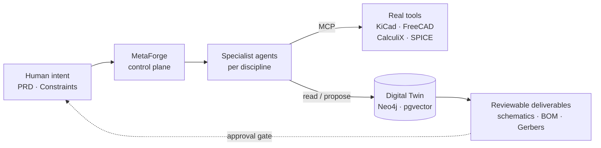

# MetaForge

**Local-first control plane for hardware design.** MetaForge turns
engineer intent — PRDs, constraints, design decisions — into
reviewable, manufacturable hardware deliverables. It orchestrates
specialist AI agents that drive real engineering tools (KiCad,
FreeCAD, CalculiX, SPICE) over the
[Model Context Protocol](https://modelcontextprotocol.io), and
keeps every step versioned and auditable.

> **Prime rule:** if it can't be versioned, reviewed, and built —
> MetaForge doesn't output it.



## Phase 1 — what works today

- **41 MCP tools** across 10 adapters (knowledge, twin, constraint,
  cadquery, calculix, freecad, kicad, project, memory, session). UAT-tested.
- **Python CLI** at `cli/forge_cli/` — `run`, `status`, `twin`,
  `proposals`, `approve`, `reject`, `ingest`, `sources`.
- **Dashboard** with 11 routes (projects, sessions, approvals, BOM,
  3D twin viewer, knowledge sources, …). Vite + React.
- **Gateway HTTP API** with 8 routers; backed by Postgres + Neo4j
  (with in-memory fallback for laptops).
- **Agent session capture** — every agent that drives MetaForge over MCP
  leaves a reviewable trail in `/sessions`: tool *actions* (auto, any
  client), *reasoning* (Claude Code hook / transcript tailer), and typed
  *design decisions* (`twin.record_decision`). See
  [`docs/session-capture.md`](docs/session-capture.md).
- **3 IDE assistants** — VS Code, KiCad, FreeCAD plugins.
- **6–7 specialist domain agents** — focused on electronics-heavy
  products (IoT, drones, embedded). Phase 2 adds 12 more.

Full inventory: **[`docs/capability-matrix.md`](docs/capability-matrix.md)**.

## Quickstart

```bash
git clone https://github.com/FidelOdok/MetaForge.git
cd MetaForge
python -m venv .venv && source .venv/bin/activate
pip install -e ".[dev,knowledge,cadquery]"
docker compose up -d postgres neo4j gateway dashboard
```

Then either:

```bash
# CLI
python -m cli.forge_cli ingest tests/fixtures/knowledge/sample.md
python -m cli.forge_cli sources list
```

…or open `http://localhost:5173/knowledge` for the dashboard, or
drive MetaForge from a Claude Code session — the repo's `.mcp.json`
is already wired.

To capture your agent sessions (thoughts, actions, decisions) into the
digital thread from any repo:

```bash
pipx install "git+https://github.com/FidelOdok/MetaForge.git#subdirectory=tools/session_capture"
metaforge-capture install --user --gateway-url http://localhost:8000
```

Five-minute walkthrough: **[`docs/getting-started.md`](docs/getting-started.md)**.

## Documentation

- **User Guide:** [getting started](docs/getting-started.md) ·
  [CLI reference](docs/cli-reference.md) ·
  [dashboard tour](docs/dashboard-tour.md) ·
  [session capture](docs/session-capture.md) ·
  [project structure](docs/project-structure.md) ·
  [capability matrix](docs/capability-matrix.md) ·
  [troubleshooting](docs/troubleshooting.md)
- **Integrations:** [Claude Code](docs/integrations/claude-code.md) ·
  [Codex](docs/integrations/codex.md) ·
  [MCP config examples](docs/integrations/mcp-config-examples.md) ·
  [LightRAG UI](docs/integrations/lightrag-ui.md)
- **Reference example:** [drone flight controller](examples/drone_flight_controller/README.md)
- **Architecture & roadmap:** [architecture](docs/architecture.md) ·
  [roadmap](docs/roadmap.md)
- **Hosted docs site:** _coming once `.github/workflows/docs.yml` runs_ —
  will be at `https://fidelodok.github.io/MetaForge/`.

## Local docs preview

```bash
pip install -e ".[dev]"
mkdocs serve              # http://127.0.0.1:8000/
```

## Status

**Phase 1 (v0.1)** — single-user, local. Schematic generation +
multi-user collaboration ship in later phases. See
[`docs/roadmap.md`](docs/roadmap.md) for the full plan.

## Contributing

This README is for engineers **using** MetaForge. If you want to
**contribute** to the codebase, start with
[`CLAUDE.md`](CLAUDE.md) — it covers the architecture, the
testing taxonomy, the observability requirements, and the git
workflow. Issue tracking lives in Linear under the **MetaForge**
team.

## License

See [`LICENSE`](LICENSE) for the project license. Reference
datasheets cached under `tests/fixtures/datasheets/` are excerpted
for technical-reference UAT testing only — original vendor
copyrights apply, see `tests/fixtures/datasheets/README.md`.
