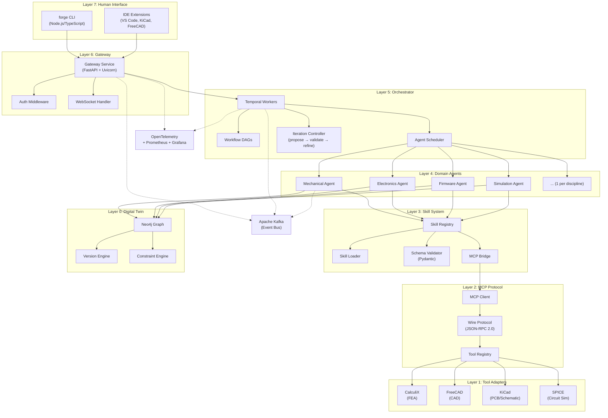
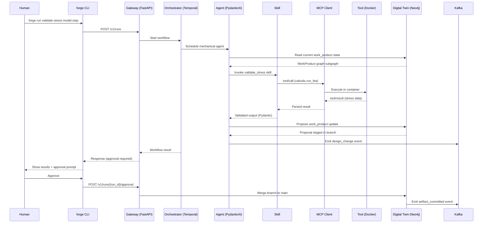

# MetaForge System Architecture

> **Version**: 0.1 (Phase 0 — Spec & Design)
> **Status**: Draft
> **Last Updated**: 2026-03-02

## 1. Overview

MetaForge is a **local-first control plane** that turns human intent into reviewable, manufacturable hardware work_products. It orchestrates specialist AI agents — one per engineering discipline — that interface with real engineering tools (KiCad, FreeCAD, CalculiX, SPICE) to produce schematics, BOMs, PCB layouts, firmware scaffolds, manufacturing files, and test plans.

### Prime Rule

> If it can't be versioned, reviewed, and built — MetaForge doesn't output it.

### Architectural Invariants

These five rules are non-negotiable across all phases:

1. **Agents never call tools directly** — all tool access goes through the MCP protocol layer.
2. **Digital Twin owns all state** — agents read from and propose changes to the Twin; they do not maintain their own state.
3. **Human-in-the-loop** — read-only by default; explicit approval is required for any write operation.
4. **Skills are the atomic unit** — every agent capability is a deterministic, schema-validated, independently testable skill.
5. **Git-native** — every work_product is versioned, diffable, and reviewable. No opaque blobs.

---

## 2. Technology Stack

| Component | Technology | Notes |
|-----------|-----------|-------|
| Primary Language | Python 3.11+ | Gateway, Agents, Twin, Skills, MCP |
| CLI / Dashboard | Node.js / TypeScript | CLI only (`forge` binary) |
| CLI Libraries | Commander.js, Inquirer, Chalk | Interactive terminal UX |
| Gateway | FastAPI + Uvicorn | HTTP/WebSocket API server |
| Agent Framework | PydanticAI + Temporal | ADR-001: structured agent outputs + durable workflows |
| LLM Providers | `openai` + `anthropic` SDKs | Unified abstraction layer |
| Validation | Pydantic v2 | All schemas, configs, messages |
| Workflow Engine | Temporal (Python SDK) | Durable execution, retries, sagas — see [wired vs in-process](#durable-tiers-wired-vs-in-process) |
| Graph Database | Neo4j | Digital Twin work_product graph |
| Event Bus | Apache Kafka | Design change events, audit log — in-process bus when unconfigured, see [wired vs in-process](#durable-tiers-wired-vs-in-process) |
| Observability | OpenTelemetry + structlog | Traces, metrics, structured logs |
| Monitoring | Prometheus + Grafana | Dashboards, alerts |
| Containerization | Docker | Tool adapter isolation |

### ADR-001: PydanticAI + Temporal

The agent framework decision (ADR-001) selects **PydanticAI** for structured LLM interactions (type-safe tool definitions, validated outputs, dependency injection) and **Temporal** for workflow orchestration (durable execution, retry policies, saga patterns). This combination replaces the originally planned custom orchestration layer.

- **PydanticAI** handles: agent definition, tool registration, structured output parsing, LLM provider abstraction.
- **Temporal** handles: workflow DAGs, agent coordination, timeout/retry policies, long-running design loops, state persistence.

### Durable tiers: wired vs in-process

The table above states the *chosen* technologies. This section states which of
them a running deployment actually uses, because the two diverged for six
months and the docs did not say so.

Both Temporal and Kafka were built in March 2026 (MET-186, MET-197) and were
**dead in every deployment** until they were wired (MET-197/MET-186 wiring):
the image installed only the `[gateway]` extra, so `aiokafka` and `temporalio`
were absent, and both modules were written to degrade gracefully without their
SDK. Measured on the live stack before the fix: the Kafka broker had **zero
topics ever created**, and the Temporal server had **zero workflow executions
ever**, while `KAFKA_BOOTSTRAP_SERVERS` and `TEMPORAL_HOST` were passed to the
gateway and read by no Python code.

| Tier | Status | What runs |
| --- | --- | --- |
| **Event bus** | ✅ wired | `create_kafka_bus()` when `KAFKA_BOOTSTRAP_SERVERS` is set — dispatches in-process to every subscriber **and** persists to the topic. Falls back to the in-process bus if the broker is unreachable. |
| **Consolidation cadence** | ✅ two drivers, pick one | the gateway's asyncio `ConsolidationScheduler` (default), or `ConsolidationWorkflow` on the Temporal worker with `METAFORGE_CONSOLIDATION_INTERVAL_SECONDS=0` |
| **Design-flow runs** (`/v1/runs`) | ✅ wired (FORGE-401) | `DesignFlowWorkflow` on the `metaforge-design-flows` queue, served by the `design-flow-worker` service. Runs survive a gateway or worker restart, including runs parked at a gate. The in-process executor remains as the test double behind `METAFORGE_FLOW_ENGINE=in_process`, and there is **no automatic fallback** to it. |

So Temporal is **runnable and registered**, owns the consolidation pass when
you hand it over, and as of FORGE-401 is the execution path for design-flow
runs.

### Where a held write actually waits (FORGE-406)

FORGE-359 built an approval gate. Nothing outside the test suite ever
constructed one, so the MCP sidecar ran with `approval_gate=None` and **every
write from a plugin was refused** with *"no approval gate is configured"*.
The guardrail was present, correct, thoroughly tested and unreachable.

Underneath that was a second problem it had been hiding: the approval store
is a process-level `InMemoryRunStore` in the *gateway*. Even once wired, a
call held inside the sidecar would sit in a queue the dashboard cannot see.

So the sidecar parks held calls in the gateway's ledger over HTTP
(`POST /v1/chat/tool_approvals`), and polls for the decision. There is
exactly **one** ledger.

A hold is closed by whichever side stops waiting (FORGE-466). The sidecar
calls `POST /v1/chat/tool_approvals/{id}/resolve` with `timed_out` when its
window closes and `canceled` when the call is cancelled; the in-process wait
(chat harness, in-gateway MCP gate) does the same on its own store. The
route is idempotent and returns `409` for a hold a human already decided, so
a decision landing as the window closes is read back and honoured, not
overwritten. Closing is best-effort: a failure is logged and counted
(`metaforge_tool_approval_resolution_total{result="failed"}`), never raised
into the tool call. As a backstop for a waiter that dies silently, each hold
stores an `approval_deadline` (the waiter's `timeout_seconds` plus 30s of
grace), and every read of the ledger expires overdue holds as `timed_out`
(`trigger="deadline"` on the same counter). Answering a `timed_out` or
`canceled` hold is a `409` naming the state and reason. A second store per process would have been the more
obvious fix and the wrong one: two queues means a reviewer clearing one while
the other fills, and no page that shows both.

`METAFORGE_GATEWAY_URL` selects it. Unset, the sidecar falls back to its own
in-process queue — correct when the MCP server runs *inside* the gateway,
wrong in a sidecar — and **logs that choice on every start-up**, because the
whole reason this went unnoticed is that the absence was only observable at
the moment somebody tried to write.

The approver comes back off the ledger entry (FORGE-393), so identity
survives the process boundary without anything being asserted across it.

### Flows through the harness plugins (FORGE-400)

Flows were dashboard-only: an agent in Claude Code or Codex could not see
that any of it existed. Four MCP tools and a run resource change that.

| Tool | |
| --- | --- |
| `flow.list` | the catalogue, as the gateway will run it (read) |
| `flow.propose` | tailor a template to an intent; the version it writes is **held** for a person, the call is not (FORGE-471) |
| `flow.status` | phase state for one run (read) |
| `flow.start_run` | start a run on an **approved** version; refused with 409 otherwise, so the call is not held (FORGE-471) |

Plus `metaforge://flow/run/{id}`, the run as markdown for a client with no
canvas, and a `/metaforge:flow` prompt.

**The rule that shapes the surface: the agent has no tool that approves its
own call.** `flow.propose` returns a proposal and an approval id and stops.
There is no `flow.approve`. An agent that could both propose and approve has
an approval step in name only — and the name is worse than nothing, because
it appears in the audit trail. Approving happens where a human is: the
dashboard queue, or inline elicitation (FORGE-360), both through the same
ledger, with the approver taken from that record (FORGE-393).

`flow.status` is deliberately *not* held. An agent following a run calls it
repeatedly; holding every poll for a human would make following a run
impossible.

**Served by the sidecar too (FORGE-462).** Until FORGE-462 only the gateway
passed the flow bindings to `bootstrap_tool_registry`. The adapters register
only when a binding is supplied, so the HTTP sidecar (which every harness
plugin talks to) skipped both `design_flow` and `run`, and none of `flow.*`
or `run.*` reached any plugin. The sidecar now builds them in
`metaforge/mcp/__main__.py` (`_build_flow_bindings`), chosen the same way as
the approval gate above:

- `METAFORGE_GATEWAY_URL` set: `metaforge/mcp/remote_flows.py` calls the
  gateway's own routes (`GET /v1/design-flows`,
  `POST /v1/design-flows/propose`, `POST /v1/runs`, `GET /v1/runs/{id}`,
  `GET /v1/runs/{id}/flow-state`). The flow-version store, the approval
  ledger and the run store are all process-level, so this is what makes a
  proposal from a plugin the one the dashboard shows and a run from a plugin
  one `/v1/runs` lists. Results have the same shape as the in-process
  bindings, asserted by test.
- Unset: the in-process bindings, correct only inside the gateway, with
  `mcp_flow_bindings_in_process` logged at start-up.

**Answering the approval decides the version.** Approving a proposal used to
move the approval and nothing else: the flow version stayed `proposed` and
`POST /v1/runs` refused it with 409 forever, so "approve, then start" could
not be completed from anywhere. `POST /v1/chat/tool_approvals/{id}` now
carries the decision to the version for `design_flow_proposal` and
`design_flow_version` approvals, with the approver taken from the approval
record (FORGE-393).

**What checking this found.** A catalogue-wide test — "no tool lets a caller
answer its own approval", matched on behaviour rather than on one forbidden
name — turned up two tools with the identical FORGE-393 bug:
`twin.approve_design_loop` took `approved_by` as an argument and
`twin.approve_engineering_change` took `approver`. FORGE-393 had fixed
promotion and guarded `ect.approve` against a *blank* approver, which is not
the same as guarding it against a supplied one. Both now read the approver
from the approval record, and both are in `HUMAN_AUTHORITY_TOOLS`.

### Watching a run (FORGE-396)

`GET /v1/runs/{id}/flow-state` returns phase-by-phase state, queried from the
Temporal workflow rather than from a projection of it. A cache that can be
stale is a live view that is sometimes wrong, with nothing on the page saying
which.

The dashboard draws it as a graph (`@xyflow/react`): a node per phase coloured
by status, the gate card on the node, and approval answerable from the graph
so a reviewer does not navigate away from the thing being approved. Selecting
a phase shows its activity beside it.

**The distinction the whole view turns on is `unknown` versus `pending`.** A
workflow *query* is answered by a worker, so with none running there is nobody
to answer — and an engine that is down renders identically to a flow that has
not started if "could not read" is allowed to become "not yet". One of those
is an outage. So the response carries `live: false` and a reason, the phases
still list (a run whose shape is known and whose progress is not should show
the shape), and every status reads `unknown`.

Known gaps, stated rather than papered over:

- **The activity lane does not yet show tool calls, decisions, evidence or
  token cost.** Those come from session capture and twin commits, which the
  workflow's event log does not carry. The panel names what is missing instead
  of rendering empty headings — an empty "Tool calls" section reads as "this
  phase made none".
- **It polls at 2s rather than streaming.** The run SSE stream carries status
  transitions only: it is fired by the run store's `on_transition`, which a
  phase starting inside the workflow never touches. Publishing phase events
  into that stream is its own change. A poll is honest about being a poll; an
  SSE subscription that silently only updated on status changes would look
  live and not be.

### Editing a flow, and where an edited flow lives (FORGE-399)

FORGE-398 generated a proposal, held it for approval, and stored only a *text
diff* of it — so approving one gave nobody a flow to start. `versions.py`
closes that, and it is shared: an edited flow needs exactly the same thing,
and two stores would have been two answers to "which flow did this run use".

**A version is immutable.** Editing produces a new version with a new id,
never a mutation, because a run pins the version it started on (FORGE-401
freezes it into the workflow input and verifies its hash), so a version
changing underneath would make a completed run's provenance a lie — and an
approval that can be edited afterwards is not an approval. That is also what
makes *"edits never change a running flow"* structurally true rather than a
policy somebody has to observe.

| Endpoint | Purpose |
| --- | --- |
| `POST /v1/design-flows/validate` | check an edit **without saving it** |
| `POST /v1/design-flows/versions` | save an edit as a new version, held for approval |
| `GET /v1/design-flows/versions/{id}` | fetch a stored version |

`POST /v1/runs` accepts a `flow_version_id`. An unapproved version is refused
there with a 409 rather than at the gate: starting work on a flow nobody
agreed to and asking afterwards is the shape this epic exists to prevent.

Validation is a separate call from saving so a rule break appears **while the
person is looking at the change that caused it** — by save time they have made
five more edits and have to work out which one the message is about. The
editor holds no validity logic of its own: a second copy of the rules in the
client would be a second answer, and the copy that disagrees is the one that
lets an unstartable flow through the UI to be refused at save.

An edit that breaks an invariant **cannot be saved** (422), and nothing is
stored when a save is refused. Saving a flow identical to its template is also
refused: an approval with nothing to approve teaches reviewers to click
through, which is how a real one later gets clicked through too.

The diff is prose rather than a structural patch, because it is read by a
person deciding whether to approve. Relaxations are shouted —
`phase 'x' NO LONGER requires 'y'` — since tightening a gate is normal and
loosening one is the change most worth attention and easiest to lose in a long
list.

### Tailoring a flow to a project (FORGE-398)

`POST /v1/design-flows/propose` takes a project's intent and returns a
tailored flow held for a human.

**The model does not write a flow.** It proposes operations from a closed set,
and the server applies them to a versioned template:

| Operation | Effect |
| --- | --- |
| `drop_phase` | the phase does not apply to this product at all |
| `add_deliverable` | require an artifact, so the phase's gate demands it |
| `set_disciplines` | the disciplines a phase fans out into |

That is the design, and the reason is worth stating. Asking a model for a
whole flow and validating the result puts the invariants in a position where
they must catch everything — and "the validator will catch it" is the
reasoning that ends with a release gate quietly missing because somebody added
a rule later than the flow that broke it. Removing a gate, removing a
deliverable and switching enforcement off are **not expressible**. The
FORGE-397 validator still runs, as a backstop rather than the only line.

Note the asymmetry: tailoring may make a flow **stricter, never laxer**. A
model that thinks a simulation is unnecessary can drop the whole phase —
visible in the diff and answerable by the person approving — but cannot keep
the phase and stop checking its output.

Every operation carries a rationale; one without is discarded, because a flow
that differs from its template and cannot say why is a flow nobody can review.
An operation naming a phase that does not exist is skipped rather than fatal,
so a model that misremembers one id does not lose the changes it got right,
and the diff describes what actually happened rather than what was asked for.

**Nothing starts from a proposal.** The response carries an `approvalId` into
the same ledger the dashboard Approvals page already watches, and this
endpoint has no ability to create a run — which is how "nothing starts before
approval" is made true rather than asserted.

**Every proposal names the model that wrote it (FORGE-468).** The configured
primary and the model that answered can differ, because the provider pipeline
falls back when the primary fails. The propose response carries
`generatedBy: {provider, model, fellBackFrom}` (`fellBackFrom` is
`"<provider>:<model>"` of the primary when a fallback answered, else `null`),
and the held approval's request payload carries the same thing as
`generated_by`, so the person approving can see whose tailoring it is. Both
are optional and `null` when unknown.

If no model is reachable the endpoint returns 503 and makes no proposal. There
is no untailored fallback: a flow the human believes was tailored, and was
not, is worse than being told the generator is down, because they would
approve it on the strength of a tailoring that never happened.

#### The generator asks before it tailors (FORGE-463)

An intent alone is not enough to tailor a flow. `"A wall shelf I can make
with what I have."` used to come back as `mech_v1` with simulation dropped
("practical load testing will suffice"), no questions and `valid: true`,
because nothing said what the shelf carries, what "what I have" is, or how
far the person wanted to go. The request now carries that context:

| Field (camelCase; snake_case also accepted) | Meaning |
| --- | --- |
| `manufacturingContext.route` | `in_house`, `vendor` or `undecided` |
| `manufacturingContext.processes` / `machines` / `stockMaterials` | what the person can actually make it with; `machines` are free-form capability descriptions |
| `manufacturingContext.productionQuantity` | how many |
| `targetMaturity` | `concept`, `sim_validated`, `physically_validated` or `released` |
| `loadsAndUse` | free text; `unknown` is a valid answer |
| `budget` | optional |

**Missing inputs are asked for, not guessed.** If the route, the target
maturity or the loads are missing (or the route is `in_house` with no stated
processes, machines or stock), the endpoint answers `200` with
`status: "needs_input"` and one grouped list of questions, each with an `id`,
the `question`, `why` it matters, an `answerType` (with `options` for
choices) and the request `field` the answer goes in. It carries **no flow, no
stored version and no held approval**. The required questions are
MetaForge's own and deterministic (`orchestrator/design_flow/context.py`);
the model may add at most three product-specific ones, marked
`source: "model"`. If the model is unreachable the required questions are
still returned, with a note saying the product-specific ones are absent.

**The flow is manufacturing-led.** With the context present, the prompt
carries it and tells the model to derive process and material choices from
the stated capabilities. Every change also records a server-written `basis`
(the route, processes, machines and stock it was made under), so a reviewer
sees what the generator was told even if the model did not cite it. An
`undecided` route adds a gated **Manufacturing Route Selection** phase ahead
of the first geometry phase, rather than letting the generator pick a route.
That operation (`add_route_selection`) is server-only: a model cannot add
phases.

A successful proposal (`201`, `status: "proposed"`) keeps every existing
field and adds `requirementsPending` (true when no requirements were sent),
`assumptions` (including an explicit "requirements pending" line) and
`openQuestions`. The proposal is validated **with** its context before
anything is stored, so a flow that drops simulation while the loads are
unknown is refused with `422 physical-verification-kept`.

`flow.propose` takes the same fields in snake_case. On `needs_input` it
returns the questions and tells the agent to ask the user rather than answer
them itself.

### The flow catalogue is served, not copied (FORGE-395)

`GET /v1/design-flows` returns every launchable flow as the gateway will run
it: phases, gate criteria, required deliverables, disciplines, the template
version, and whether the flow passes its own invariants.

It exists because the dashboard used to hold the catalogue itself, in
`dashboard/src/api/endpoints/design-flows.ts`, under a comment asking people
to keep it in sync by hand. It was not in sync, and nothing could have said
so:

- **`design_v1` was missing entirely** — the *default* flow, the one a run
  gets when the request names none, could not be selected in the wizard whose
  purpose is selecting flows.
- four phase titles were paraphrased (`Electronics` for *Electronics Design*,
  `Manufacturing preparation` for *Manufacturing Prep*, two case
  differences), so the wizard described phases by names no run uses.

The short display labels moved into the template files rather than staying in
the dashboard. Serving `name` alone would have moved the drift instead of
removing it: the client would still have had to hold a friendly label per
flow, and that copy would rot the same way.

A flow that breaks an invariant is **listed and marked unstartable**, not
hidden and not silently offered. Offering it and refusing at `POST /v1/runs`
reads as the gateway being broken rather than the flow being wrong; hiding it
makes a flow that exists and cannot be seen.

### Design flows on Temporal (FORGE-401)

`/v1/runs` used to start a design flow as an `asyncio.create_task` in the
gateway process against an `InMemoryRunStore`. A restart lost every in-flight
run, and the runs it lost most expensively were the ones parked at a gate —
those have a human already committed to them.

```
POST /v1/runs ──> freeze_flow() ──> DesignFlowWorkflow (Temporal)
                  template id,          │
                  version,              ├─ phase ──> run_phase activity
                  content hash          │             (heartbeats, 3 retries)
                                        ├─ gate ───> wait_condition + durable timer
                                        │             answered by a signal from
                                        │             the approval ledger
                                        └─ change ─> continue_as_new
```

Four things are worth knowing about the shape:

- **One workflow, not one per flow.** `DesignFlowWorkflow` is an interpreter
  over the approved flow, passed in as *data*. A new template is a data
  change, and every run replays against the same definition.
- **The flow is frozen and hashed at approval.** The workflow verifies the
  hash before it starts. Editing `spec.py` cannot change what an in-flight
  run is doing, and a completed run stays replayable.
- **A gate that expires is a rejection**, on a durable timer. Not "carry on",
  which would promote work nobody read; not "wait forever", which leaves a
  run that reads as live.
- **A mid-run flow change is only applied at a gate boundary**, via
  `continue_as_new` with the new frozen flow. No phase is in flight there, so
  nothing half-done is orphaned.

### Flow templates and invariants (FORGE-397)

The built-in flows live in `orchestrator/design_flow/templates/*.yaml`, one
file per flow, each carrying a `version`. They were 530 lines of Python
literals in `spec.py`; that was fine while flows were fixed and stops being
fine once a flow can be tailored, because a generated or edited flow is data
and has to be diffable against the template it came from.

Every run records the template id, its version and the content hash of the
frozen flow, so *"which flow did this run use"* has an answer that survives
the template being edited afterwards.

**Invariants are server-enforced** (`invariants.py`), checked before a flow is
approved and again when a run starts — not as a lint somebody can skip. A
violation names the rule and the phase, and the validator reports all of them
at once rather than the first:

| Rule | Why it exists |
| --- | --- |
| `release-gate-exists` | otherwise a flow runs to completion with nobody approving the result |
| `no-pass-without-data` | a gate with no required deliverables cannot tell an empty phase from a complete one, and neither can the human answering it |
| `gates-enforce-what-they-require` | `enforce_deliverables: false` under a gate is a decorative gate — worse than none, because the approval then looks like evidence |
| `deliverable-is-producible` | a gate requiring `simulation_result` before any simulation phase is not a strict flow, it is one that always fails — and it fails at the gate rather than where somebody could have seen it |
| `requirements-are-verified` | a twin full of claims nothing checks reads, on every dashboard, exactly like a product that passed. A phase with id `requirements` counts as recording requirements whatever artifact it uses, so a flow cannot pass this vacuously (FORGE-463) |
| `physical-verification-kept` | a flow that commits a `cad_model` must keep a phase producing `simulation_result` or `verification_report`, or require a `test_plan` at a gate as the recorded alternative. While the loads are unknown, not even a test plan may replace it (FORGE-463) |
| `unique-phase-ids` | readiness, activity history and the live view all key on the phase id |
| `has-phases` | — |

Auto-approved gates are exempt from the human-gate rules: they are
checkpoints, not decisions, and holding them to rules about what a person can
tell apart would force deliverables onto phases nobody reviews.

**If Temporal is unreachable, starting a run fails with a 503 and no run
record is created.** There is deliberately no fall-through to the in-process
executor. That fallback would work, which is the problem: runs keep starting
and nobody discovers the engine is not durable until a restart eats a day's
work. `METAFORGE_FLOW_ENGINE=in_process` selects the old executor explicitly,
warns on every run start that runs are not durable, and is there for tests and
for contributors without Docker.

**Both engines run exactly the approved version** (FORGE-474). A run started
with `flow_version_id` (what `flow.start_run` sends) is pinned to that stored
version on either engine: Temporal receives its frozen flow as workflow input,
and the in-process executor walks a definition rebuilt from the same frozen
flow, after checking its hash and checking that the rebuild reproduces it. A
dropped phase stays dropped and an added deliverable is required. If the
in-process engine cannot reproduce the version exactly, the run is refused
with a `409` and no record is left; it never substitutes the template the
version came from. Every design-flow run records `flow_engine`
(`temporal` or `in_process`), `flow_template_id`, `flow_version`,
`flow_version_id` when it was started from a stored version, and
`flow_content_hash`. `GET /v1/runs/{id}` returns the engine, version id and
hash as top-level fields, and `/flow-state` lists the version's phases rather
than the template's.

Running it needs two services: `temporal` and `design-flow-worker`. Without
the worker, runs are created durably and then sit forever, because nothing
polls the queue — which is the quiet half of the same failure the 503 makes
loud.

Both cadence drivers build the tier through one factory,
`digital_twin.memory.consolidation.bootstrap.build_consolidation_stack()`
(MET-723). Before that existed the wiring lived inside the gateway's lifespan,
so a worker would accept `ConsolidationWorkflow` and then fail its activity with
*"orchestrator was not bound before activity ran"* — the workflow was
registered but could not run. A worker-driven pass is now measured end to end:
eight experiences fetched from pgvector, grouped, synthesized, and the
execution `COMPLETED`.

Because the worker synthesizes in its own process, it needs the same
`OPEN_ROUTER_API_KEY` the gateway has (MET-724). Without it the tier degrades to
`StubLLMClient`, which answers confidence `0.0`; the validator then rejects
every insight, so a pass fetches and synthesizes and still accepts nothing.

The event bus is additive by design: adopting Kafka does not change dispatch
semantics, it adds a durable log, which is what makes the MET-567 deposit
paths replayable rather than best-effort.

---

## 3. System Architecture

### 7-Layer Stack

```
┌─────────────────────────────────────────────────┐
│  Layer 7: Human Interface                       │
│  CLI (forge) · IDE Extensions · Approval UI     │
├─────────────────────────────────────────────────┤
│  Layer 6: Gateway Service (FastAPI)             │
│  HTTP/WebSocket API · Auth · Rate Limiting      │
├─────────────────────────────────────────────────┤
│  Layer 5: Orchestrator (Temporal)               │
│  Workflow DAGs · Agent Scheduling · Iteration   │
├─────────────────────────────────────────────────┤
│  Layer 4: Domain Agents (PydanticAI)            │
│  1 agent per discipline · Skill invocation      │
├─────────────────────────────────────────────────┤
│  Layer 3: Skill System                          │
│  Registry · Loader · Schema Validation · Bridge │
├─────────────────────────────────────────────────┤
│  Layer 2: MCP Protocol Layer                    │
│  Client · Wire Protocol · Tool Registry         │
├─────────────────────────────────────────────────┤
│  Layer 1: Tool Adapters (Docker)                │
│  KiCad · FreeCAD · CalculiX · SPICE             │
├─────────────────────────────────────────────────┤
│  Layer 0: Digital Twin (Neo4j)                  │
│  WorkProduct Graph · Versioning · Constraints      │
└─────────────────────────────────────────────────┘
```

### Architecture Diagram



---

## 4. Dual-Mode Operation

MetaForge supports two operational modes that determine the design loop behavior:

### Assistant Mode (Default)

The human drives the design process. MetaForge validates and advises.

```
Human edits design files
        │
        ▼
  File watcher detects changes
        │
        ▼
  Agents validate post-edit
        │
        ▼
  Results shown in IDE / CLI
        │
        ▼
  Human reviews and iterates
```

- All tool operations are **read-only** by default.
- Validation runs automatically on file changes.
- Agents flag issues but do not modify files without explicit approval.
- Approval gates: per-file, per-agent, or per-session granularity.

### Autonomous Mode

AI agents drive the design loop. Humans review at gate checkpoints.

```
Human provides PRD + constraints
        │
        ▼
  Orchestrator creates workflow DAG
        │
        ▼
  Agents execute: propose → validate → refine
        │
        ▼
  Gate checkpoint: human reviews
        │
        ▼
  Approved → commit to Twin
  Rejected → agents refine
```

- Agents can propose file modifications (writes go through approval).
- The propose → validate → refine loop runs until constraints pass or iteration limit is reached.
- Gate checkpoints are configurable: per-step, per-phase, or end-of-workflow.
- All proposed changes are staged in a Twin branch before approval.

---

## 5. Component Descriptions

### 5.1 Gateway Service (Layer 6)

**Technology**: FastAPI + Uvicorn

The Gateway is the "front door" — the single entry point for all client interactions.

| Responsibility | Details |
|---------------|---------|
| HTTP API | RESTful endpoints for project CRUD, agent status, Twin queries |
| WebSocket | Real-time agent progress, validation results, approval requests |
| Authentication | API key + JWT token-based auth |
| Rate Limiting | Per-client request throttling |
| Request Routing | Dispatches to Temporal workflows or direct Twin queries |

### 5.2 Orchestrator (Layer 5)

**Technology**: Temporal (Python SDK)

The Orchestrator is the "brain" — it coordinates multi-agent workflows as durable Temporal workflows.

| Responsibility | Details |
|---------------|---------|
| Workflow DAGs | Define agent execution order based on dependency graphs |
| Agent Scheduling | Queue and dispatch agent tasks with priority |
| Iteration Control | Manage the propose → validate → refine loop |
| Dependency Resolution | Determine inter-agent data dependencies |
| Failure Handling | Retry policies, compensation (saga pattern), timeout management |
| State Persistence | Temporal handles workflow state durably across restarts |

### 5.3 Domain Agents (Layer 4)

**Technology**: PydanticAI

Each agent is a specialist for exactly one engineering discipline (1:1 ratio). Agents are implemented as PydanticAI agents with typed tool definitions and structured outputs.

| Property | Details |
|----------|---------|
| Ratio | 1 agent : 1 discipline |
| Implementation | PydanticAI `Agent` class with domain-specific system prompt |
| Tools | Skills registered as PydanticAI tools via the Skill Registry |
| State | Stateless — all persistent state lives in the Digital Twin |
| Communication | Via Temporal workflows (agent-to-agent) and Kafka events |

### 5.4 Skill System (Layer 3)

**See**: [`docs/skill_spec.md`](skill_spec.md)

Skills are the atomic unit of domain expertise. Each skill is deterministic, schema-validated, and independently testable.

| Property | Details |
|----------|---------|
| Definition | 5-file directory: `definition.json`, `SKILL.md`, `schema.py`, `handler.py`, `tests.py` |
| Validation | Pydantic models for input/output schemas |
| Registry | Auto-discovery + manual registration |
| MCP Bridge | Skills invoke tools exclusively through the MCP protocol |

### 5.5 MCP Protocol Layer (Layer 2)

**See**: [`docs/mcp_spec.md`](mcp_spec.md)

The Model Context Protocol layer provides the wire protocol for all tool access. No agent or skill ever calls an engineering tool directly.

| Property | Details |
|----------|---------|
| Protocol | JSON-RPC 2.0 over stdio (local) or HTTP (remote) |
| Messages | `tool/list`, `tool/call`, `tool/result`, `tool/error`, `health/check` |
| Registry | Tool catalog with capability declarations and health tracking |
| Execution | Invocation lifecycle with timeout, retry, and cleanup |

### 5.6 Tool Adapters (Layer 1)

Tool adapters wrap engineering tools in MCP-compatible servers. Each adapter runs in an isolated Docker container.

| Adapter | Tool | Phase | Capabilities |
|---------|------|-------|-------------|
| CalculiX | FEA solver | Phase 1 | Mesh validation, stress analysis, thermal analysis |
| FreeCAD | CAD modeler | Phase 1 | Geometry export, STEP/STL conversion, measurement |
| KiCad | PCB/Schematic | Phase 1 (read-only), Phase 2 (write) | ERC, DRC, BOM export, Gerber export |
| SPICE | Circuit sim | Phase 1 | DC/AC analysis, transient simulation |

### 5.7 Digital Twin (Layer 0)

**See**: [`docs/twin_schema.md`](twin_schema.md)

The Digital Twin is the single source of design truth — a versioned work_product graph stored in Neo4j.

| Property | Details |
|----------|---------|
| Storage | Neo4j graph database |
| Nodes | WorkProduct, Constraint, Version, Component, Agent |
| Edges | DEPENDS_ON, IMPLEMENTS, VALIDATES, CONTAINS, etc. |
| Versioning | Git-like branching model for the graph |
| Constraints | Cross-domain constraint engine with rule evaluation |
| API | CRUD, query, version, and constraint operations |

---

## 6. Data Flow

### Request Lifecycle



### Propose → Validate → Refine Loop

The core iteration loop used in Autonomous Mode:

```
┌──────────────────────────────────────────────┐
│                                              │
│  ┌─────────┐    ┌──────────┐    ┌─────────┐ │
│  │ PROPOSE │───▶│ VALIDATE │───▶│ REFINE  │ │
│  └─────────┘    └──────────┘    └─────────┘ │
│       ▲                              │       │
│       │         Constraints          │       │
│       │           failed             │       │
│       └──────────────────────────────┘       │
│                                              │
│              Constraints pass                │
│                     │                        │
│                     ▼                        │
│              ┌────────────┐                  │
│              │ GATE CHECK │                  │
│              └────────────┘                  │
│                     │                        │
│              Human approves                  │
│                     │                        │
│                     ▼                        │
│              ┌────────────┐                  │
│              │   COMMIT   │                  │
│              └────────────┘                  │
└──────────────────────────────────────────────┘
```

1. **Propose**: Agent generates or modifies work_products using skills.
2. **Validate**: Constraint engine checks all cross-domain rules against the proposed state.
3. **Refine**: If constraints fail, the agent receives violation details and iterates. Max iterations are configurable (default: 5).
4. **Gate Check**: Once constraints pass, the proposal is presented for human review (in Autonomous Mode) or auto-committed (if pre-approved).
5. **Commit**: Approved changes are merged from the Twin branch into the main branch.

---

## 7. Observability Stack

| Layer | Technology | Purpose |
|-------|-----------|---------|
| Traces | OpenTelemetry (OTLP) | Distributed tracing across Gateway → Orchestrator → Agent → Tool |
| Logs | structlog | Structured JSON logging with correlation IDs |
| Metrics | Prometheus | Agent latency, skill success rates, tool invocation counts |
| Dashboards | Grafana | Real-time system health, workflow progress |

### Trace Context Propagation

Every request receives a trace ID at the Gateway. This ID propagates through:

- Temporal workflow context
- PydanticAI agent invocations
- MCP tool calls
- Kafka event headers
- Neo4j transaction metadata

This enables end-to-end tracing from human intent to tool execution.

---

## 8. Monorepo Structure

Each top-level directory maps to an architectural layer:

```
MetaForge/
├── cli/                        # Layer 7: CLI commands (Node.js/TypeScript)
│   ├── index.ts                # Main entry point
│   └── commands/               # Command implementations
│
├── api_gateway/                # Layer 6: Gateway Service (FastAPI)
│   ├── app.py                  # FastAPI application
│   ├── routes/                 # API route handlers
│   ├── middleware/             # Auth, rate limiting, CORS
│   └── websocket/              # WebSocket handlers
│
├── orchestrator/               # Layer 5: Coordination engine (Temporal)
│   ├── workflows/              # Temporal workflow definitions
│   ├── activities/             # Temporal activity implementations
│   ├── worker.py               # Temporal worker entry point
│   └── scheduler.py            # Agent execution queuing
│
├── twin_core/                  # Layer 0: Digital Twin (Neo4j)
│   ├── models/                 # Pydantic models (WorkProduct, Constraint, etc.)
│   ├── graph_engine.py         # Neo4j CRUD + traversal
│   ├── versioning/             # Branch, merge, diff operations
│   ├── constraint_engine/      # Cross-domain constraint validation
│   └── api.py                  # Public Twin API
│
├── skill_registry/             # Layer 3: Skill management
│   ├── registry.py             # Skill catalog with auto-discovery
│   ├── loader.py               # Dynamic import + validation
│   ├── schema_validator.py     # Pydantic schema enforcement
│   ├── skill_base.py           # Abstract base class (SkillBase)
│   └── mcp_bridge.py           # Skill → MCP protocol bridge
│
├── domain_agents/              # Layer 4: One agent per discipline
│   ├── mechanical/             # Mechanical Engineering agent
│   ├── electronics/            # Electronics Engineering agent
│   ├── firmware/               # Embedded Software agent
│   └── simulation/             # Simulation & Validation agent
│
├── mcp_core/                   # Layer 2: MCP protocol client
│   ├── client.py               # MCP client implementation
│   ├── protocol.py             # JSON-RPC 2.0 wire protocol
│   └── schemas.py              # Pydantic message schemas
│
├── tool_registry/              # Layer 1: MCP tool servers (Docker)
│   ├── registry.py             # Tool catalog + health tracking
│   ├── execution_engine.py     # Invocation, timeout, retry
│   └── tools/                  # Individual tool adapters
│       ├── calculix/           # FEA analysis
│       ├── freecad/            # CAD operations
│       ├── kicad/              # PCB/schematic validation
│       ├── spice/              # Circuit simulation
│       ├── gazebo/             # ROS-native physics/dynamics simulation
│       ├── omniverse_usd/      # GLB -> OpenUSD conversion
│       └── isaac_sim/          # PhysX physics + RTX rendering (ephemeral GPU)
│
├── ide_assistants/             # Layer 7: IDE integrations
│   ├── vscode_extension/       # VS Code (firmware development)
│   ├── pcb_extension/          # KiCad plugin
│   └── cad_extension/          # FreeCAD plugin
│
├── tests/                      # Cross-cutting tests
│   ├── unit/
│   ├── integration/
│   └── e2e/
│
├── examples/                   # Reference projects
│   └── drone-fc/               # Drone flight controller (first demo)
│
└── docs/                       # Specification documents
    ├── architecture.md          # This document
    ├── twin_schema.md           # Digital Twin graph schema
    ├── skill_spec.md            # Skill system specification
    ├── mcp_spec.md              # MCP protocol specification
    ├── roadmap.md               # Phased delivery roadmap
    └── governance.md            # Contribution & governance
```

---

## 9. User Project Structure

When a user runs `forge setup`, MetaForge creates this structure for their hardware project:

```
project/
├── PRD.md                      # Human intent (product requirements)
├── constraints.json            # Design rules and constraints
├── decisions.md                # Design decisions log
├── eda/kicad/                  # Schematic + PCB files
├── bom/                        # BOM, alternates, costing
├── firmware/src/               # Firmware source + pinmap.json
├── manufacturing/              # Gerbers, pick & place
├── tests/bringup.md            # Bring-up checklists
└── .forge/
    ├── config.toml             # Project configuration
    ├── sessions/               # Agent session records
    └── traces/                 # Execution traces (OpenTelemetry)
```

This structure is version-controlled in Git. Every file produced by MetaForge is diffable and reviewable.

---

## 10. Security & Isolation Model

### Tool Isolation

All tool adapters run in Docker containers with strict isolation:

| Control | Implementation |
|---------|---------------|
| Filesystem | Bind-mounted workspace directory (read-only by default) |
| Network | No external network access (host-only) |
| Resources | CPU and memory limits per container |
| Lifecycle | Containers are ephemeral — created per invocation, destroyed after |
| Secrets | No secrets passed to tool containers |

### Human-in-the-Loop

| Operation | Default | Override |
|-----------|---------|----------|
| Read work_products | Allowed | — |
| Run validation | Allowed | — |
| Modify work_products | Blocked | Requires explicit approval |
| Commit to Twin | Blocked | Requires explicit approval |
| Execute tools | Allowed (sandboxed) | — |

**Approval gates fail closed (FORGE-469).** The orchestrator's
`wait_for_approval` activity (used by `HardwareDesignWorkflow`) needs a
Temporal runtime to wait for a human decision. When `temporalio` cannot be
imported it raises `ApprovalRuntimeUnavailableError` and the run fails; it
never approves. It used to return an approval from `approver_id="auto"`, so a
missing dependency silently passed every human gate. Each refusal logs
`approval_activity_no_runtime` at error level, increments
`metaforge_approval_gate_no_runtime_total{required_role}`, and fires the
critical `ApprovalGateNoTemporalRuntime` alert. Tests that need a decided gate
inject an explicit test double rather than relying on a missing runtime.

**Iteration gates fail closed too (FORGE-470).** `IterationController`
(the propose-validate-refine loop in `orchestrator/iteration_controller.py`)
used to approve and merge a converged branch whenever no approval workflow was
configured, even with `auto_approve` off. It now ends that loop `BLOCKED`,
merges nothing, logs `iteration_gate_no_approval_workflow` at warning level,
increments `metaforge_iteration_gate_unattended_total{outcome="blocked"}`,
and fires the warning `IterationGateNoApprovalWorkflow` alert. An explicit
`auto_approve` still merges, but the result records the non-human approver
`auto:iteration_controller`, the `iteration_gate_auto_approved` event is
logged at warning, and it is counted as `outcome="auto_approved"`
(informational, no alert).

### Data Locality

MetaForge is local-first:

- All design data stays on the user's machine.
- LLM API calls send only the minimum context needed (skill inputs, not full project files).
- No telemetry is sent without explicit opt-in.
- The Digital Twin graph is a local Neo4j instance.

---

## 11. Terminology Glossary

| Term | Definition |
|------|-----------|
| **Gateway Service** | FastAPI HTTP/WebSocket API server — the "front door" for all client interactions |
| **Orchestrator** | Temporal-based coordination engine — the "brain" that manages workflow DAGs |
| **Domain Agent** | PydanticAI agent for one engineering discipline (1:1 ratio) |
| **Skill** | Atomic unit of domain expertise — deterministic, schema-validated, independently testable |
| **Digital Twin** | Neo4j work_product graph — single source of design truth |
| **MCP** | Model Context Protocol — JSON-RPC 2.0 wire protocol for tool access |
| **Tool Adapter** | Docker-containerized wrapper that exposes an engineering tool via MCP |
| **WorkProduct** | Any design output: schematic, BOM, PCB layout, firmware source, test plan, etc. |
| **Constraint** | A rule that must be satisfied across work_products (e.g., voltage rail ≤ 3.3V) |
| **Twin Branch** | A named snapshot of the work_product graph for isolated changes (like a Git branch) |
| **Gate Checkpoint** | A point in a workflow where human approval is required before proceeding |
| **PRD** | Product Requirements Document — the human intent that drives a design session |
| **Assistant Mode** | Human-driven design with post-edit validation (default mode) |
| **Autonomous Mode** | AI-driven design with propose → validate → refine loop |
| **Propose → Validate → Refine** | Core iteration loop: agent proposes changes, constraints validate, agent refines on failure |
