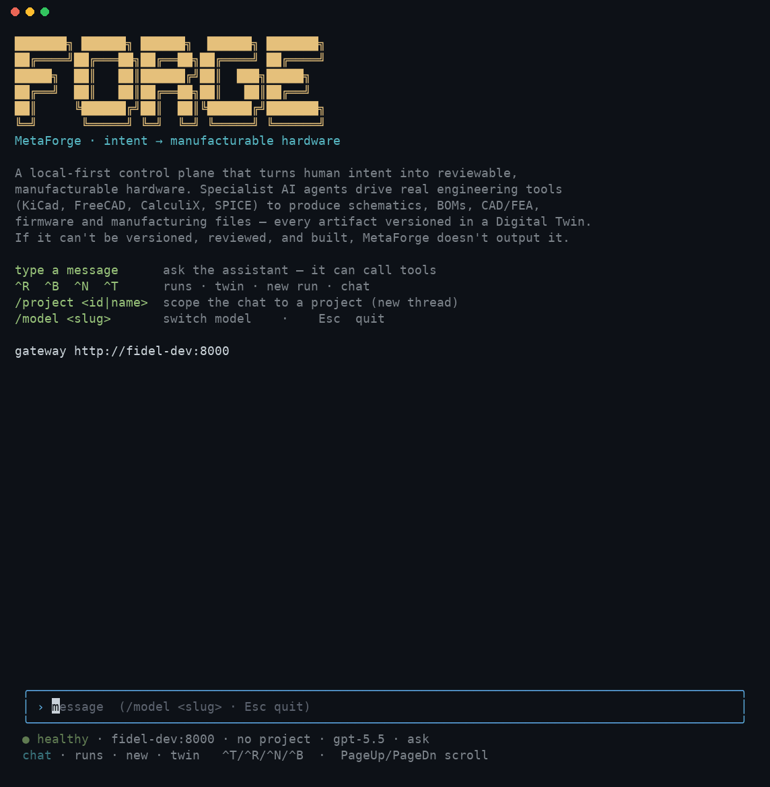
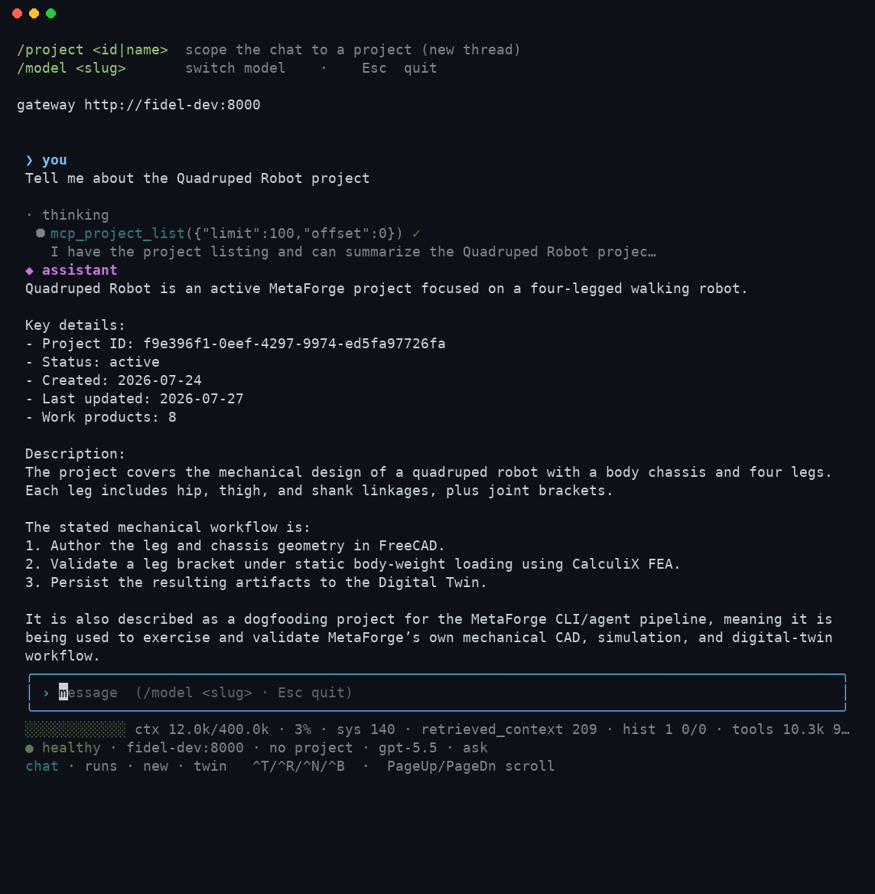

# CLI Reference

> **Status:** Phase 1 (v0.1). Every `python -m cli.forge_cli`
> subcommand, with one example per command. Source of truth:
> `cli/forge_cli/main.py` and `cli/forge_cli/sources.py`. Last
> verified against `main` on 2026-05-10.

The CLI is a thin Python wrapper over the gateway HTTP API. It
needs a running gateway on the other end (`docker compose up gateway`,
or `python -m api_gateway.server`).

## Invocation

After `pip install -e .`, use the `forge` console script:

```bash
forge <command> [args...]
```

Equivalently, run the module directly (no install step needed):

```bash
python -m cli.forge_cli <command> [args...]
```

Both entry points are identical. `forge` is a Python console-script (it
requires the project's Python environment, like `forge-server`). Examples in
this reference use `python -m cli.forge_cli`, but `forge` works everywhere in
its place.

### Standalone binary (no Python required)

**Install a prebuilt binary** (from GitHub Releases):

```bash
# latest release, auto-detects your OS/arch
curl -fsSL https://raw.githubusercontent.com/FidelOdok/MetaForge/main/scripts/install.sh | sh

# or a specific version
curl -fsSL https://raw.githubusercontent.com/FidelOdok/MetaForge/main/scripts/install.sh | sh -s v0.1.0
```

This drops `forge` into `~/.local/bin` (override with `FORGE_BIN_DIR`) and, if
that directory isn't already on your `PATH`, adds it to your shell profile
(`.zshrc` / `.bashrc` / `.bash_profile` / `.profile`) automatically. Restart your
shell afterward. Set `FORGE_NO_MODIFY_PATH=1` to skip the profile edit and get a
manual instruction instead. Windows users download `forge-windows-x64.exe` from
the [Releases page](https://github.com/FidelOdok/MetaForge/releases) directly.

Binaries are published per platform on every `v*` tag by the `release` workflow
(`.github/workflows/release.yml`): `forge-linux-x64`, `forge-macos-arm64`, and
`forge-windows-x64.exe`. Intel Macs aren't prebuilt (GitHub is retiring Intel
runners) — build from source there.

**Build it yourself** with PyInstaller:

```bash
pip install -e ".[build]"          # installs pyinstaller
scripts/build_forge_binary.sh      # produces dist/forge
./dist/forge chat --help
```

The CLI is a thin HTTP client (only `httpx` + `structlog` beyond the standard
library), so the bundle stays small (~40 MB); the gateway/server stack is
excluded. The resulting `dist/forge` runs on its own — copy it onto a target
machine and run it directly.

> **Platform note:** PyInstaller bundles for the platform it runs on. Build on
> each OS you want to ship (macOS / Linux / Windows) — typically a CI matrix —
> rather than cross-compiling. This is a developer/packaging step; most users
> should just `pip install -e .` and use the `forge` console script above.

## Global flags

These work on every subcommand and must be passed **before** the
subcommand name:

| Flag | Default | Purpose |
|---|---|---|
| `--format {table,json,compact}` | `table` | Output rendering |
| `--gateway-url <url>` | `$METAFORGE_GATEWAY_URL` or `http://localhost:8000` | Override gateway base URL |

```bash
python -m cli.forge_cli --format json --gateway-url http://gateway.local:8000 proposals
```

## Interactive workspace (bare `forge`)

Running the [standalone binary](#standalone-binary-no-python-required) with no
subcommand in a terminal opens the **interactive workspace**: streaming chat plus
panes for runs, the twin, and a new run. It talks to the same gateway as the
Python CLI, but it is a separate front-end — the slash commands below are *its*
commands, not [`chat`](#chat-interactive-assistant-repl)'s.

```bash
forge                                   # open the workspace
forge --project "Monitor Build Demo"    # …already scoped to a project
forge ui --debug                        # verbose logging (see below)
```

| Flag | Purpose |
|---|---|
| `--project <id\|name>` | Start the chat scoped to a project. Takes an id, an exact name, or a unique substring (`--project gimbal`). An ambiguous or unknown name is reported on screen and the session starts unscoped |
| `--debug` | Verbose logging, including raw SSE frames (see [Logs & debugging](#logs-debugging-the-interactive-tui)) |

Any other flag (`--help`, `--version`, `--gateway <url>`) runs the scriptable
command layer instead of opening the UI. `--project` works there too, on the
one-shot turn:

```bash
forge chat -m "what's in this project?" --project "Monitor Build Demo"
```

| Key / command | Effect |
|---|---|
| `^T` `^R` `^B` `^N` | chat · runs · twin · new run |
| `PageUp` / `PageDn` | Scroll the transcript |
| `/resume` | Pick a previous session (title · scope · activity) and continue it — the transcript backfills and the server rebuilds the conversation's context per turn (MET-595). `forge --continue` / `-c` resumes the most recent session directly at launch |
| `/project [id\|name]` | Show the current project, or switch to one. Switching starts a **new thread** — see below. `/project none` leaves the project |
| `/model <slug>` | Change the model for this session (persisted to `~/.forge/config.json`) |
| `/provider <id>` | Change the provider for this session |
| `/help` | List the slash commands |
| `Esc` | Quit |

### What it looks like

Real captures from the compiled binary (`tmux` driving `forge` against a live
gateway) — not mockups.

**Launch** — the welcome screen, a message composed and ready to send:


**A turn in progress** — the model calls a tool, then answers. This is the
literal answer to "Tell me about the Quadruped Robot project": one
`project.get`-style call, then a formatted response using what it returned.



The same turn once it settles, so the tool-call trace and the full answer are
both visible at once:



**The Runs pane** (`^R`) — same footer, different content pane:


### What "project" in the status line means

The project segment of the status footer is the **scope of the live chat thread**
(`no project` when there isn't one) — not a UI preference. Scope is fixed when
the gateway creates the thread (`scope_kind` / `scope_entity_id`), and a
project-scoped thread is the one that gets the
[project brief](#project-scoped-chat) prepended to every turn: the project's
intent, its work products, and the instruction to pass `project_id` when
committing CAD or recording a decision. So scope decides whether new deliverables
land in the project — an unscoped chat can still discuss it, but nothing it
produces is filed there.

Two consequences worth knowing:

- **`/project` starts a new thread.** Typed by you, it switches by creating a
  **new** thread in the new scope, so the conversation restarts; the workspace
  says so in the transcript rather than letting you discover it when the agent
  has forgotten what you were discussing.
- **Asking the agent in prose does rescope — in place.** "Switch to project X"
  is answered by the agent calling `chat.set_project_scope`, which rescopes the
  **current** thread rather than starting a new one — the conversation is kept,
  and the very next turn gets the new project's brief. An ambiguous or unknown
  name is refused (the agent won't guess), and it must say so explicitly rather
  than continuing to talk about the project as if the switch happened silently.
  Watch the footer either way: it always reflects the thread's real scope,
  whoever changed it.

## Commands

### `config` — configure the CLI (wizard)

```
config                       # interactive wizard
config show                  # print current config
config path                  # print config file location
config set <key> <value>     # set one value (gateway_url|provider|model|mode)
```

Runs an interactive wizard that picks your **gateway URL**, lists the gateway's
**providers** and **models** (`/v1/harness/*`) for you to choose, and sets a
default **mode**. Saved to `~/.forge/config.json` (override with `$FORGE_CONFIG`).
`forge chat` then uses these defaults, so you don't repeat `--provider`/`--model`
each run.

```bash
forge config                                 # guided setup
forge config set model claude-sonnet-5       # or set values directly
forge config show
```

Precedence: an explicit CLI flag wins over the config file, which wins over the
`METAFORGE_GATEWAY_URL` env var, which wins over the built-in default.

!!! note "What this does and doesn't configure"
    `config` stores *your client's* choice of gateway and the per-turn
    provider/model it sends. To give the gateway a **credential** (API key or a
    ChatGPT subscription), use [`auth`](#auth-provider-login-selection) — it does
    not set the `METAFORGE_CHAT_HARNESS` flag, which is a server-side setting.

### `auth` — provider login & selection

```
auth list                          # providers with configured/active state
auth login [--provider P] [--method {api-key,oauth}] [--model M] [--no-activate]
           [--mode {auto,loopback,device,manual}] [--port N] [--no-browser]
auth use <provider> [-m MODEL]     # set the durable active provider/model
auth logout <provider>             # forget a stored credential
```

Log in to an LLM provider **from the CLI** — like `opencode`/OpenClaw — and the
credential is **pushed once to the gateway** (the shared runtime for CLI, TUI,
and dashboard) and stored `0600`, so every client uses it with no restart.

- **API key** (any provider): `forge auth login` → pick a provider → enter the
  key at a hidden prompt. Stored in the gateway's auth store and injected into
  the model call (preferred over env).
- **ChatGPT/Codex OAuth** (subscription, no API key): pick `openai-codex` → a
  browser OAuth loopback runs **on your machine** (localhost:1455); only the
  resulting token is sent to the gateway (written where the Codex adapter reads
  it). On a headless client use `--mode device` or `--mode manual`.

```bash
forge auth login --provider openai            # API key for OpenAI
forge auth login --provider openai-codex      # ChatGPT subscription (browser)
forge auth use openai gpt-4o                   # make it the active model
forge auth list
```

Active-selection precedence: an explicit `chat --provider/--model` flag → the
`auth use` selection stored on the gateway → the gateway's `METAFORGE_LLM_*`
env. If the gateway sets `METAFORGE_HARNESS_ADMIN_TOKEN`, the CLI sends it
automatically (from the same env var) so writes are authorized.

### `chat` — interactive assistant REPL

```
chat [-m MESSAGE] [--thread ID] [--session ID] [--project ID] [--title T]
     [--provider P] [--model M] [--timeout S]
     [--mode {ask,auto,plan}] [--no-stream] [--no-color]
     [--hooks PATH] [--no-hooks]
```

A Claude-Code-style terminal front-end for the MetaForge assistant. It's a
**thin client** over the gateway's `/v1/chat` surface (harness-backed), so the
agent loop, tools, and approval gates all run server-side. Streams the answer
token-by-token, renders a live tool-call timeline, and prompts for approval on
gated design changes.

```bash
# Interactive session (default: streaming, ask-mode)
python -m cli.forge_cli chat

# One-shot, scriptable
python -m cli.forge_cli chat -m "What is the stress margin on the bracket?"
```

| Flag | Default | Purpose |
|---|---|---|
| `-m, --message <text>` | — | One-shot: send a single message and exit |
| `--thread <id>` | new thread | Reuse an existing chat thread |
| `--session <id>` | random | Scope-entity id for a new thread |
| `--project <id>` | — | Scope the chat to a project (see [Project-scoped chat](#project-scoped-chat)) |
| `--title <text>` | `CLI session` | Title for a new thread |
| `--provider <id>` | gateway default | Per-turn provider override |
| `--model <id>` | gateway default | Per-turn model override |
| `--timeout <s>` | `120` | Per-turn timeout (an agent turn runs inside the request) |
| `--mode {ask,auto,plan}` | `ask` | How gated change proposals are handled (see below) |
| `--no-stream` | off | Use request/refetch instead of SSE streaming |
| `--no-color` | off | Disable ANSI colors |
| `--hooks <path>` | `.forge/hooks.json` | Lifecycle-hooks config |
| `--no-hooks` | off | Disable lifecycle hooks |

#### Permission modes

The consequential action in chat is a **gated design-change proposal**
(`twin.propose_change`). `--mode` (or `/mode` in-session) governs how new
proposals are handled after each turn:

| Mode | Behavior |
|---|---|
| `ask` (default) | Prompt `[a]pprove / [r]eject / [s]kip` per proposal (interactive); one-shot mode just prints a notice |
| `auto` | Auto-approve new proposals (prints a warning on entry) |
| `plan` | Hold — list proposals but never apply them (nothing mutates the twin) |

#### Project-scoped chat

Pass `--project <id>` to tie the conversation to a project. The thread is created
with `scope_kind=project`, and every turn is led by a **project brief** injected
into the agent's context: the project name, intent, and the list of work products
already in its digital thread. The agent grounds its answers in that context and
is told to pass `project_id="<id>"` when it commits new CAD or records a decision,
so new deliverables land in the same project.

```bash
# List projects, then chat scoped to one
python -m cli.forge_cli projects list
python -m cli.forge_cli chat --project 250aec91-6d31-4a26-bb71-5e0d1e6fedb9
```

Once scoped, ask the agent about the project ("what's in this project?", "what
did we decide about the base plate?") and it answers from the work products; ask
it to build geometry and the result is saved back into the project.

Mid-conversation you can also just ask the agent to switch: "switch to the Foo
project" (or "leave the project") makes it call `chat.set_project_scope`, which
rescopes the **same** thread in place — the conversation is kept, and the next
turn's brief reflects the new project. This works whether the thread started
scoped or unscoped. An ambiguous or unknown name is refused rather than guessed,
and the agent must tell you explicitly that it switched.

#### From prompt to CAD

There are three paths from a typed intent to a committed `cad_model` work product
(all record into the twin as loadable, dashboard-visible geometry):

| Path | Command | When |
|---|---|---|
| **Text → CAD** (LLM compiles a spec, deterministic build) | `forge cad from-text "<description>" [--project-id <id>]` | Plain-English input with reproducible output: the LLM emits the spec, which is then built deterministically and echoed back for review |
| **Deterministic assembly** (no LLM) | `forge cad build <spec.json> [--project-id <id>]` | Reliable, repeatable multi-part geometry from a hand-authored spec — best when you already know the exact geometry |
| **Agent-driven** | `forge chat --project <id>` then ask it to build the part | Exploratory / conversational authoring; the agent drives the FreeCAD tools and commits by reference |
| **Single primitive** | `forge design "<goal>" --project-id <id>` | A quick one-shot primitive via the gated design flow |

The declarative spec (shared by `cad build` and produced by `cad from-text`) is a
JSON object `{name, parts:[…], project_id?}` where each part is a
`box`/`cylinder`/`cone`/`sphere` with `parameters`, and optional `position`,
`holes`, `fillet`, and `chamfer`. See
[`examples/cad/`](https://github.com/FidelOdok/MetaForge/tree/main/examples/cad)
for the full Pan-Tilt Gimbal reference (base, yaw, pitch).

```bash
# Text → CAD: describe it, get a reviewable spec + committed model
python -m cli.forge_cli cad from-text \
  "a 100x100x6 base plate with 4 M3 corner holes and a 40mm dia, 45mm tall boss" \
  --project-id 250aec91-6d31-4a26-bb71-5e0d1e6fedb9
```

`from-text` needs the gateway's chat harness + an LLM provider configured (it
uses the LLM only to translate text → spec; the geometry is authored by the same
deterministic builder as `cad build`). If the description can't be turned into a
valid spec it returns a clear `422` rather than building something wrong.

Add `--dry-run` to **compile and review the spec without building it** — it
prints a per-part summary, flags any geometry problems, and emits the full spec
JSON. Save that JSON and run `forge cad build <file>` for a fully deterministic
build, or drop `--dry-run` to build immediately:

```bash
python -m cli.forge_cli cad from-text "a rounded 60x40x8 bracket" --dry-run > bracket.json
# review/edit bracket.json, then:
python -m cli.forge_cli cad build bracket.json --project-id <id>
```

#### Slash commands (interactive)

| Command | Effect |
|---|---|
| `/help` | List commands |
| `/model [provider] <model>` | Show or set the provider/model for the session |
| `/mode [ask\|auto\|plan]` | Show or set the permission mode |
| `/plan` | Shortcut for `/mode plan` |
| `/thread` | Show the current thread id |
| `/clear` | Start a fresh thread (clears context; keeps the `--project` scope) |
| `/exit`, `/quit` | Leave the chat |

#### Hooks

Run your own shell commands on lifecycle events by creating `.forge/hooks.json`:

```json
{
  "hooks": {
    "session_start": [{"command": "echo session started"}],
    "user_prompt":   [{"command": "echo \"you asked: $FORGE_HOOK_MESSAGE\""}],
    "post_turn":     [{"command": "./scripts/on_turn.sh"}],
    "session_end":   [{"command": "echo bye"}]
  }
}
```

Events: `session_start`, `user_prompt` (before send), `post_turn` (after the
reply), `session_end`. Each command receives the payload as `FORGE_HOOK_*`
environment variables (e.g. `FORGE_HOOK_EVENT`, `FORGE_HOOK_MESSAGE`,
`FORGE_HOOK_THREAD_ID`) and as JSON on stdin. Hooks are best-effort — a failure
or timeout logs a warning and never breaks the turn.

> **Note:** the assistant only produces replies when the gateway has an LLM
> provider configured for the harness (`METAFORGE_CHAT_HARNESS` + credentials).
> Without one, `forge chat` still runs but reports "no reply".

### `routine` — scheduled background runs

```
routine [--file PATH] {add,list,remove,run-due}
routine add "<prompt>" --every 30m [--provider P] [--model M] [--mode M]
routine list
routine remove <id>
routine run-due
```

A daemonless way to run assistant prompts on a schedule (the "routines" idea).
Routines are stored in `.forge/routines.json`; `run-due` fires every routine
whose interval has elapsed (creating an assistant thread and sending the prompt)
and records `last_run`. Wire `run-due` to OS cron or a loop for real scheduling:

```bash
# add a nightly design-review prompt
python -m cli.forge_cli routine add "Review the latest DRC results" --every 1d

# in crontab: fire due routines every 15 minutes
*/15 * * * * python -m cli.forge_cli routine run-due
```

Intervals are `30s` / `10m` / `2h` / `1d` (not full cron). Each `run-due` is
best-effort — one routine's failure doesn't stop the others.

### `run` — invoke a skill

```
run <skill_name> --work_product <uuid> [--params JSON] [--session-id <uuid>]
```

Triggers a skill against a target work product via the gateway's
`/v1/skills/run` endpoint. Returns the resulting session id and the
skill's output payload.

| Arg / flag | Required | Notes |
|---|---|---|
| `skill_name` | yes | Registry id (e.g. `validate_stress`) |
| `--work_product <uuid>` | yes | Target node id |
| `--params <json>` | no | JSON object; default `{}` |
| `--session-id <uuid>` | no | Existing session to attach to |

```bash
python -m cli.forge_cli run validate_stress \
  --work_product 4f1c-... \
  --params '{"load_n": 500, "axis": "x"}'
```

### `status` — session status

```
status <session_id>
```

```bash
python -m cli.forge_cli status 8e2a-...
```

Returns the current state, the agent that owns the run, and the last
few tool calls. Useful when chasing a long-running workflow.

### `twin query` — fetch a node

```
twin query <node_id>
```

```bash
python -m cli.forge_cli twin query 7c91-...
```

Properties + first-hop neighbours. Same data the
`twin.get_node` MCP tool returns; this is the CLI surface.

### `twin list` — filter work products

```
twin list [--domain <domain>] [--type <work_product_type>]
```

```bash
python -m cli.forge_cli twin list --domain electronics --type schematic
```

| Flag | Notes |
|---|---|
| `--domain` | One of: `mechanical`, `electronics`, `firmware`, `simulation`, … |
| `--type` | Work-product type: `cad_model`, `schematic`, `bom`, etc. |

### `proposals` — list pending proposals

```
proposals
```

Lists every change proposal that's still in `pending`. The output
includes `change_id` (use it with `approve` / `reject`), the
proposing agent, the target work product, and the diff summary.

### `approve` / `reject` — act on a proposal

```
approve <change_id> --reason "..." [--reviewer <id>]
reject  <change_id> --reason "..." [--reviewer <id>]
```

Both commands require a `--reason` (audit-trail). `--reviewer`
defaults to `cli-user`; pass your identity if you have a real
reviewer record.

```bash
python -m cli.forge_cli approve 1a2b-... --reason "fits power budget"
python -m cli.forge_cli reject  1a2b-... --reason "BOM cost over budget"
```

### `ingest` — index docs into the knowledge layer

```
ingest <path> [--type <knowledge_type>] [--no-recursive] [--dry-run]
              [--work-product <uuid>] [--metadata <json>] [--timeout <seconds>]
```

Ingests a file or a directory tree into the L1 knowledge layer. Same
backend the `knowledge.ingest` MCP tool uses — this CLI is the second
surface for the same store.

| Flag | Default | Notes |
|---|---|---|
| `path` | _(required)_ | File or directory |
| `--type` | inferred from path | `design_decision` / `component` / `failure` / `constraint` / `session` |
| `--no-recursive` | off | When `path` is a directory, only its immediate children |
| `--dry-run` | off | Print what would be ingested; make no HTTP calls |
| `--work-product <uuid>` | none | Tag every chunk with a `source_work_product_id` |
| `--metadata <json>` | none | Extra metadata round-tripped on search hits |
| `--timeout <seconds>` | 300 | Per-request HTTP timeout (env: `METAFORGE_INGEST_TIMEOUT`) |

```bash
# One file with explicit type
python -m cli.forge_cli ingest tests/fixtures/datasheets/rp2040.txt \
  --type component \
  --metadata '{"vendor": "Raspberry Pi", "mpn": "RP2040"}'

# Whole directory, dry run first
python -m cli.forge_cli ingest docs/decisions/ --type design_decision --dry-run
python -m cli.forge_cli ingest docs/decisions/ --type design_decision
```

### `sources list` — list ingested sources

```
sources list [--type <knowledge_type>] [--project <uuid>] [--limit <n>]
```

```bash
python -m cli.forge_cli sources list
python -m cli.forge_cli sources list --type component --limit 25
```

Default columns: `knowledge_type`, `source_path`, `fragment_count`,
`indexed_at`. Pass `--format json` to get the raw envelope.

### `sources show` — single-source detail

```
sources show <source_id>
```

```bash
python -m cli.forge_cli sources show 'datasheet://rp2040'
```

Renders metadata + chunks. `source_id` is the `source_path` you used
at ingest time. Exits `2` with `Error: source not found …` if the
path is unknown.

### `sources delete` — purge a source

```
sources delete <source_id> [--yes]
```

```bash
python -m cli.forge_cli sources delete 'datasheet://rp2040' --yes
```

Removes every chunk for a source. Without `--yes` the CLI asks for
interactive confirmation. Returns the count of deleted chunks.

### `design` — run a gated design flow

```
design <goal> [--flow hardware_v1|mech_v1|design_v1] [--project-id <uuid>]
              [--no-start] [--no-watch]
```

```bash
# Design a board end to end and watch the phase/gate transitions stream
python -m cli.forge_cli design "an I2C IMU breakout board, 3.3 V from 5 V USB, 25 x 20 mm"

# Scope it to a project and pick a flow
python -m cli.forge_cli design "a self-balancing robot controller" \
  --flow hardware_v1 --project-id <uuid>
```

A friendly wrapper over `runs create` for the [design-flow
harness](architecture/design-flow-harness.md): it starts the gated flow for a
product goal, prints the run id, and (by default) streams the live phase/gate
transitions. `--flow` picks the lifecycle (`hardware_v1` full 7-phase, `mech_v1`
mechanical vertical, `design_v1` demo); `--no-watch` returns immediately;
`--no-start` creates the run without starting it. Each run pauses at every gate
for human sign-off — approve with `runs approve <run_id>`.

When `--project-id` is omitted the command **auto-creates a project** named from
the goal and scopes the run to it, so the deliverables show on the Projects page;
pass `--project-id` to target an existing project instead.

### `cad build` — author a multi-part assembly

```
cad build <spec.json> [--project-id <uuid>]
```

```bash
python -m cli.forge_cli cad build examples/cad/gimbal-base.json --project-id <uuid>
```

Authors a complex, multi-part CAD assembly **deterministically** (no LLM) from a
declarative spec and commits it to the twin as a loadable `cad_model`. The spec is
a JSON object `{ "name", "parts": [ … ], "project_id"? }`, where each part is a
primitive:

```json
{
  "name": "Gimbal Base",
  "parts": [
    {"name": "Base Plate", "kind": "box", "parameters": {"width": 100, "length": 100, "height": 6}},
    {"name": "Yaw Housing", "kind": "cylinder", "parameters": {"radius": 20, "height": 45}, "position": [50, 50, 6]},
    {"name": "Tripod Boss", "kind": "cylinder", "parameters": {"radius": 10, "height": 8}, "position": [50, 50, -8]}
  ]
}
```

`kind` is one of `box` / `cylinder` / `cone` / `sphere`; `position` is an optional
`[x, y, z]` in mm. A part may also carry `holes` — mounting/fastener holes drilled
into it (a boolean subtract, so no PartDesign body is needed):

```json
{"name": "Mount Plate", "kind": "box", "parameters": {"width": 50, "length": 50, "height": 5},
 "holes": [{"x": 6, "y": 6, "diameter": 3.4}, {"x": 44, "y": 44, "diameter": 3.4}]}
```

Each hole has `x`, `y` (centre in the part's local frame), `diameter`, and an
optional `depth` (through-hole if omitted). Under the hood it drives the FreeCAD tools
(`create_primitive → create_assembly → add_part_to_assembly → export_model`) and
commits via the geometry recorder — the reliable, blob-in-Python path that needs
no LLM. Prints the committed node id and its viewer URL.

### `projects` — list, inspect, and delete projects

```
projects list [--json] [--status <status>]
projects get <project_id> [--json]
projects delete <project_id> [--yes]
```

```bash
# See every project (or just the drafts)
python -m cli.forge_cli projects list
python -m cli.forge_cli projects list --status draft

# Inspect one, then delete a stale draft
python -m cli.forge_cli projects get <uuid>
python -m cli.forge_cli projects delete <uuid> --yes
```

The Projects API surface (`/v1/projects`). `list` prints a table of id / name /
status / work-product count (`--status` filters, e.g. to find `draft` projects to
clean up); `delete` asks for confirmation unless `--yes` is passed.

### `runs` — drive harness runs directly

```
runs create [--goal <text>] [--request-json <json>] [--no-start]
runs list [--json]
runs get <run_id> [--json]
runs watch <run_id>
runs approve <run_id>
runs reject <run_id>
```

The lower-level surface over `/v1/runs`. `runs create --request-json '{...}'`
takes a full run request (used by `design` under the hood); `watch` streams a
run's SSE status; `approve`/`reject` resolve a run paused at a gate.

## Output formats

`--format table` (default) prints a fixed-column ASCII table.
`--format json` dumps the gateway response verbatim — best for
piping into `jq`. `--format compact` is the smallest one-line-per-row
form, useful in scripts.

```bash
python -m cli.forge_cli --format json sources list | jq '.sources[].sourcePath'
```

## Environment variables

| Var | Used by | Purpose |
|---|---|---|
| `METAFORGE_GATEWAY_URL` | every command | Base URL for the gateway |
| `METAFORGE_HARNESS_ADMIN_TOKEN` | `auth` (client + gateway) | If set on the gateway, credential writes require it; the CLI sends the matching value from this env var |
| `METAFORGE_INGEST_TIMEOUT` | `ingest` | Override the default 300 s timeout |
| `METAFORGE_MAX_OUTPUT_TOKENS` | chat (gateway-side) | Output-token cap per model completion (default 8192) |
| `FORGE_LOG` | `forge` (TUI) | `1`/`true` enables verbose logging (raw SSE frames); same as `--debug` |
| `FORGE_LOG_FILE` | `forge` (TUI) | Override the log path (default `~/.forge/logs/session.log`) |

## Logs & debugging the interactive TUI

The interactive `forge` TUI owns the terminal, so it cannot print diagnostics to
the screen without corrupting the UI. Instead it appends a JSONL session log to
**`~/.forge/logs/session.log`** — always on, a few lines per session:

- `chat.thread_created` / `chat.stream_open` — stream lifecycle
- `chat.send` — a turn was submitted (`chars`, `model`, `provider`)
- `chat.turn_done` — **one line per turn** with `events`, `deltas`, `chars`, and
  a `reason` when the turn came back empty (e.g. `"N delta event(s) but 0
  characters — likely an SSE payload/parse mismatch"`). This is the signal that
  turns a "(no reply)" into a diagnosable cause.
- `chat.stream_error_event` / `chat.stream_failed` — transport/agent errors
- `chat.stream_closed_reconnecting` / `chat.stream_reconnecting` / `chat.stream_connected`
  — the SSE stream auto-reconnects with backoff on a dropped/restarted gateway;
  the workspace shows a "reconnecting…" indicator and resumes when it's back

Run with `--debug` (or `FORGE_LOG=1`) to also capture every raw SSE frame
(`sse.frame`) and a `sse.empty_delta` warning whenever a delta event carries no
text — the exact fingerprint of a payload/parse mismatch:

```bash
forge --debug            # interactive TUI, verbose logging on
tail -f ~/.forge/logs/session.log | jq .
```

An empty assistant turn now shows *why* inline — `(no reply — <cause>)` — instead
of a single opaque string.

## Troubleshooting

If a command hangs or returns a connection error, check
[`troubleshooting.md`](troubleshooting.md) for the gateway-down /
WSL2 / `.mcp.json` recovery paths.
