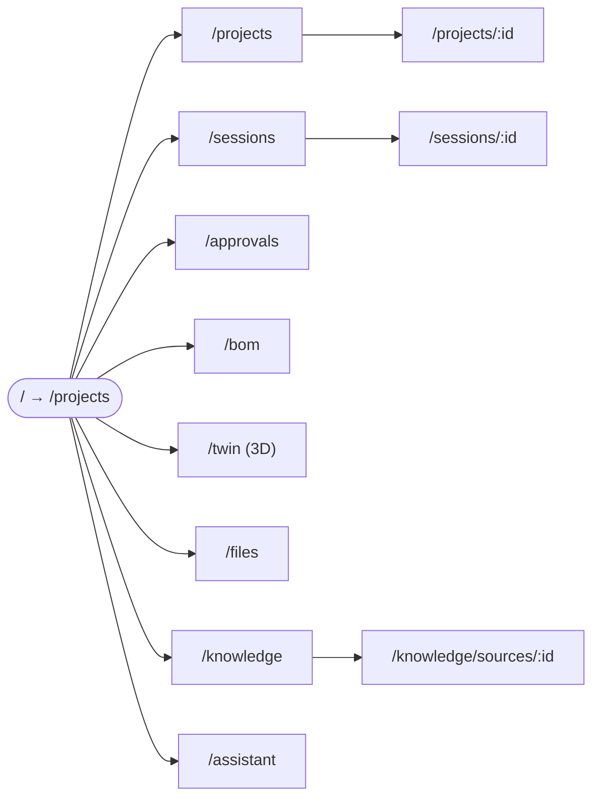

# Dashboard Tour

> **Status:** Phase 1 (v0.1). One section per route. Boot the app
> with `docker compose up gateway dashboard` then open
> `http://localhost:5173`. Layout sketches are ASCII; the visual
> design follows the Kinetic Console design system. Last verified
> against `dashboard/src/App.tsx` on 2026-05-10.

## Layout shell

Every page renders inside the same shell:

```
┌──────────────────────────────────────────────────────────────────┐
│  Topbar — segment label · search · session indicator             │
├──────────┬───────────────────────────────────────────────────────┤
│ Side bar │                                                       │
│ • Proj   │                  Page content                         │
│ • Sess   │                                                       │
│ • Appr   │                                                       │
│ • BOM    │                                                       │
│ • Twin   │                                                       │
│ • Files  │                                                       │
│ • Know   │                                                       │
│ • Asst   │                                                       │
└──────────┴───────────────────────────────────────────────────────┘
```

Sidebar entries map 1-to-1 to the routes below. The default landing
page is `/projects`.



## `/projects` — project list

The home of the dashboard. Lists every MetaForge project the gateway
knows about, with a "+ New project" action.

```
┌──────────────────────────────────────────────────────────────────┐
│ Projects                                          [+ New project]│
├──────────────────────────────────────────────────────────────────┤
│ Name          │ Status   │ Created          │ Actions            │
│ Drone FC      │ Active   │ 2026-04-12       │ Open · Delete      │
│ Sensor Hub    │ Draft    │ 2026-05-02       │ Open · Delete      │
│ ...                                                              │
└──────────────────────────────────────────────────────────────────┘
```

- **Backed by:** `GET /v1/projects`, `POST /v1/projects`,
  `DELETE /v1/projects/{id}`.
- **Use it to:** spin up a new project (creates a `CAD_MODEL`
  work-product seed), or jump into an existing one.

## `/projects/:id` — project detail

Drill-in for a single project. Shows the work-product tree, recent
sessions touching this project, and the active constraint set.

- **Backed by:** `GET /v1/projects/{id}`.
- **Use it to:** find a `work_product` UUID for the CLI's
  `--work_product` flag, or check which sessions are still active.

## `/sessions` — workflow run list

Each row is one workflow run (session). Status chip, owning agent,
target work product, last activity timestamp.

```
┌──────────────────────────────────────────────────────────────────┐
│ Sessions                                                         │
├──────────────────────────────────────────────────────────────────┤
│ Session  │ Agent       │ Target          │ Status   │ Updated   │
│ 8e2a-... │ Mechanical  │ housing_v2      │ Running  │ 30 s ago  │
│ 1a7c-... │ Electronics │ schem_main      │ Done     │ 12 m ago  │
│ ...                                                              │
└──────────────────────────────────────────────────────────────────┘
```

- **Backed by:** `GET /v1/sessions`.
- **Use it to:** find the session id you want to dig into. Same data
  as `python -m cli.forge_cli status <id>` but in a clickable list.

## `/sessions/:id` — session detail

Per-session view. Agent messages, the tool calls it issued, the
proposal (if any) it produced, and any structured output.

- **Backed by:** `GET /v1/sessions/{id}`.
- **Use it to:** debug a stuck or failed run; replay the agent's
  reasoning before approving its proposal.

## `/approvals` — pending change-proposal review

The human-in-the-loop gate. Lists every change proposal an agent has
submitted that hasn't been approved or rejected yet. Click a row to
see the diff vs. the current Twin state.

```
┌──────────────────────────────────────────────────────────────────┐
│ Approvals                                                        │
├──────────────────────────────────────────────────────────────────┤
│ Proposal  │ Agent       │ Target          │ Submitted │ Action  │
│ 1a2b-...  │ Mechanical  │ housing_v2      │ 5 m ago   │ Review  │
│ ...                                                              │
└──────────────────────────────────────────────────────────────────┘
```

- **Backed by:** approvals API on the gateway.
- **Use it to:** approve or reject proposals. Same outcome as
  `python -m cli.forge_cli approve <id> --reason …`, but with a
  side-by-side diff view.

## `/bom` — BOM viewer

Renders `bom/bom.csv` with per-row sourcing data, alternates, and
cost. Read-only in v1; cost-engineering edits arrive in Phase 2.

- **Backed by:** gateway BOM endpoints under `/v1/bom/...`.
- **Use it to:** sanity-check supply-chain coverage before a fab
  release.

## `/twin` — 3D viewer

A React-Three-Fiber (Three.js) viewer for STEP / GLB exports. The
toolbar lists the work products with geometry attached; selecting
one fetches its GLB and renders it.

- **Backed by:** `GET /v1/twin/files/...` for the GLB blob.
- **Use it to:** visually inspect a CAD result. The viewer is
  designed for assemblies up to ~10 MB GLB; larger models stream but
  may be slow on a laptop GPU.

## `/files` — legacy file browser

Pre-existing flat file browser of everything under the project root.
Useful when a work product references a file path you want to open
directly. Will be folded into `/projects/:id` work-product tree in a
later iteration; kept around for backwards compatibility.

- **Backed by:** gateway files API.

## `/knowledge` — ingested-sources table

The L1 knowledge corpus, served as a sortable, filterable table.

```
┌──────────────────────────────────────────────────────────────────┐
│ Knowledge sources    [type ▾]  [project ▾]  [search]             │
├──────────────────────────────────────────────────────────────────┤
│ Type           │ Source path                │ Frags │ Indexed    │
│ component      │ datasheet://rp2040         │  142  │ 2 h ago    │
│ design_decision│ uat://decisions/foo.md     │   12  │ 1 d ago    │
│ ...                                                              │
└──────────────────────────────────────────────────────────────────┘
```

- **Backed by:** `GET /api/v1/knowledge/sources` (the same data the
  `metaforge://knowledge/sources` MCP resource exposes).
- **Use it to:** see what's in the KB, filter by `knowledge_type` or
  project, click a row to drill in.
- Empty state: shows "No sources ingested yet — run forge ingest
  &lt;path&gt;" with a link to [`cli-reference.md`](cli-reference.md).

## `/knowledge/sources/:id` — source detail

Drill-in for one source. v1 ships a placeholder; the full chunk
viewer is on the v2 list. The CLI's `sources show` command is the
faster path for now (see [`cli-reference.md`](cli-reference.md)).

## `/assistant` — chat panel

Free-form chat against the orchestrator. Useful for asking questions
that span agents ("what's blocking the housing FEA?") without picking
a specific tool yourself.

- **Backed by:** `POST /v1/chat`.
- **Use it to:** explore. For deterministic, reproducible work,
  prefer the CLI or specific MCP tool calls — chat is best-effort.

## What's not on the dashboard yet

- **No dedicated MCP-tool runner UI.** Tool calls land via the CLI,
  Claude Code, or Codex; the dashboard only shows their *results*
  (sessions, proposals, BOM updates). A "scratchpad" tool-runner is
  on the v2 list.
- **No graph visualisation** of the Twin. Sigma.js / Cytoscape was
  scoped out of v1; if you need it today, query the Twin via
  `python -m cli.forge_cli twin query` or the `twin.query_cypher`
  MCP tool and render externally.
- **No screenshots in this doc.** A screenshot pipeline isn't pinned
  yet; ASCII sketches are the source of truth until then.

## Boot recipes

| Goal | Command |
|---|---|
| Dev mode (hot reload) | `docker compose up gateway dashboard-dev` |
| Prod build (static) | `cd dashboard && npm run build && npm run preview` |
| Just the gateway, drive UI elsewhere | `docker compose up gateway` then point dashboard at it |
