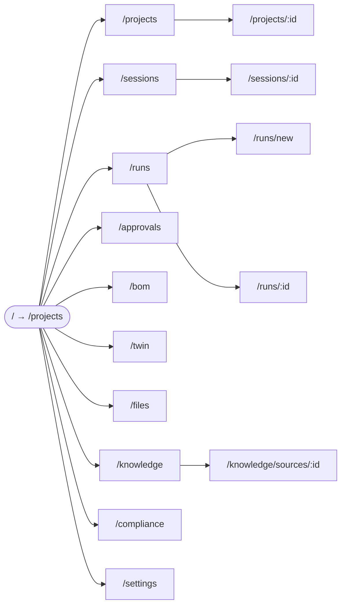

# Dashboard Tour

> **Status:** Phase 1 (v0.1). One section per route. Boot the app
> with `docker compose up gateway dashboard` then open
> `http://localhost:5173`. Layout sketches are ASCII. Last verified
> against `dashboard/src/App.tsx` on 2026-09-24.

## Look and feel

The dashboard is the MetaForge engineering workspace: light by default,
with a dark theme. The theme control in the topbar offers **Light**,
**Dark** and **System**; the choice is stored in the browser under
`metaforge.theme` and applied before first paint, so there is no flash
of the wrong theme.

Every colour resolves through a CSS variable in
`dashboard/src/styles/console.css`: the dark palette is defined on
`:root` and remapped for light mode under `[data-theme=light]`. The
accent is `#ff5a0a` in both themes. Type is DM Sans, with Roboto Mono
for identifiers and code. The 3D and robot viewers keep literal
colours, because WebGL can't read CSS variables.

## Layout shell

Every page except the full-width twin renders inside the same shell:

```
┌──────────────────────────────────────────────────────────────────┐
│ [≡] Section › Details     project ▾  ☀  Sample  👤  ● Gateway    │
├────┬─────────────────────────────────────────────────────────────┤
│ ◆  │                                                             │
│    │                                                             │
│ ▣  │  WORKSPACE: Projects · Agent sessions · Runs · Approvals    │
│ ▣  │                                                             │
│ ▣  │  ENGINEERING: Digital twin · Bill of materials ·            │
│ ▣  │               Files & artifacts · Knowledge · Compliance    │
│    │                                                             │
│ ⚙  │  Page content                                               │
└────┴─────────────────────────────────────────────────────────────┘
```

- **Nav rail.** A floating rail with icon tooltips, in two groups
  (*Workspace* and *Engineering*), with **Settings & connection** and a
  **Documentation** link at the foot. The topbar toggle expands it to
  show labels and the full logo; the choice is remembered. Below 760px
  it becomes a drawer with a backdrop.
- **Topbar.** Breadcrumb (section, plus *Details* on a drill-in page),
  the active-project switcher, the theme control, the **Sample** link
  (opens the offline sample workspace; reads **Exit sample** while it
  is open), an account link to `/settings`, and the **gateway chip**,
  which reads *Connecting*, *Connected* or *Unavailable* from
  `GET /health`.
- A **Skip to main content** link is the first focusable element.

Sidebar entries map 1-to-1 to the routes below. The default landing
page is `/projects`; unknown paths show a *Page not found* screen.


```mermaid
flowchart LR
    home(["/ → /projects"])
    proj["/projects"]
    projDetail["/projects/:id"]
    sess["/sessions"]
    sessDetail["/sessions/:id"]
    runs["/runs"]
    runNew["/runs/new"]
    runDetail["/runs/:id"]
    appr["/approvals"]
    bom["/bom"]
    twin["/twin"]
    files["/files"]
    know["/knowledge"]
    srcDetail["/knowledge/sources/:id"]
    comp["/compliance"]
    settings["/settings"]

    home --> proj
    proj --> projDetail
    home --> sess
    sess --> sessDetail
    home --> runs
    runs --> runNew
    runs --> runDetail
    home --> appr
    home --> bom
    home --> twin
    home --> files
    home --> know
    know --> srcDetail
    home --> comp
    home --> settings
```

## `/projects`: project workspace

The home of the dashboard.

```
┌──────────────────────────────────────────────────────────────────┐
│ YOUR ENGINEERING WORKSPACE                                        │
│ Projects.                                         [+ New project]│
├───────────────┬───────────────┬───────────────┬──────────────────┤
│ Active        │ Runs in       │ Awaiting      │ Work products    │
│ projects  03  │ progress  01  │ review    02  │             14   │
├───────────────┴───────────────┴───────────┬───┴──────────────────┤
│ Project library   [▦ grid | ☰ list]       │ Review queue         │
│ [search…]              [Recently updated] │ Recent artifacts     │
│ All · Active · Draft · Archived           │ The engineering loop │
│ ┌──────────┐ ┌──────────┐ ┌──────────┐    │                      │
│ │ Drone FC │ │ Sensor   │ │ …        │    │                      │
│ └──────────┘ └──────────┘ └──────────┘    │                      │
└───────────────────────────────────────────┴──────────────────────┘
```

- **Backed by:** `GET /v1/projects`, `POST /v1/projects`,
  `GET /v1/runs`, `GET /health`.
- **Metric cards** link through to the library, `/runs`, `/approvals`
  and `/files`. **Review queue** lists runs waiting at an approval gate.
- When the gateway can't be reached, a **Connect your engineering
  gateway** notice offers *Retry* and *Set up connection* (`/settings`)
  and the cards show a dash instead of zero.

## `/projects/:id`: project detail

Drill-in for a single project: metrics, an action row (**Start design
run**, **Open twin & agent**, **Bill of materials**) and the project's
artifact updates, newest first.

- **Backed by:** `GET /v1/projects/{id}`.
- **Use it to:** find a `work_product` UUID for the CLI's
  `--work_product` flag, rename or delete the project, or set it as the
  active project.

## `/sessions`: agent sessions

Each row is one captured agent session: status, owning agent, project,
last activity.

- **Backed by:** `GET /v1/sessions`.
- **Use it to:** find the session you want to dig into. Same data as
  `python -m cli.forge_cli status <id>` but in a clickable list.

## `/sessions/:id`: session detail

Per-session timeline of thoughts, actions and decisions (see
[Session capture](session-capture.md)).

- **Backed by:** `GET /v1/sessions/{id}`.

## `/runs`: design runs

Every design-flow run, with search and a status filter, and a **New
design run** action.

- **Backed by:** `GET /v1/runs`.

## `/runs/new`: start a design run

A two-step wizard: **Define the intent**, then **Review & launch**.

```
┌───────────────────────────────────────────┬──────────────────────┐
│ What are you building?                    │ PLANNED LIFECYCLE    │
│ Project        [Choose a project ▾]       │ Hardware & robotics  │
│ Engineering intent                        │ 01 Intent            │
│ [Design a compact actuator to lift …]     │ 02 Stakeholder needs │
│ Engineering workflow                      │ 03 Requirements      │
│ (•) Hardware & robotics                   │ …                    │
│ ( ) Mechanical design                     │ each: Human review   │
│                   [Cancel] [Review run →] │ gate                 │
└───────────────────────────────────────────┴──────────────────────┘
```

- **Backed by:** `GET /v1/projects`, and on launch
  `POST /v1/runs` with a `design_flow` request (`hardware_v1` or
  `mech_v1`) and `start: true`. On success it opens `/runs/:id`.
- The lifecycle panel lists the selected flow's real phases from
  `orchestrator/design_flow/spec.py`; every phase has a human review
  gate. `/runs/new?project=<id>` preselects a project.

## `/runs/:id`: run detail

One run's phases, gate decisions and outputs. A run that can't be
loaded shows a *Run could not be loaded* state rather than *not found*.

- **Backed by:** `GET /v1/runs/{id}`.

## `/approvals`: human review

The human-in-the-loop gate, in three parts: **run approval gates**
(runs paused for a decision), **tool approvals** (agent tool calls
waiting for a yes/no), and **change proposals** submitted against the
Twin, each with a diff against the current state.

- **Backed by:** `GET /v1/runs`, `GET /v1/chat/tool_approvals`,
  `GET /v1/assistant/proposals`.
- **Use it to:** approve or reject. Same outcome as
  `python -m cli.forge_cli approve <id> --reason …`, but with a
  side-by-side diff view.

## `/bom`: bill of materials

Per-row sourcing data with part images, purchase and datasheet links,
and prices in their own currency. Exports to CSV.

- **Backed by:** `GET /v1/bom`.
- **Use it to:** sanity-check supply-chain coverage before a fab
  release.

## `/twin`: digital twin

The full-width twin workspace. A toolbar switches between **Graph**
(work products and their relationships), **Model** (the React Three
Fiber viewer for STEP/GLB geometry), **Sim** and **Assembly**. A status
strip counts nodes needing attention and nodes without relationships,
with a **Start design run** shortcut. Selecting a node opens the
inspector (*Overview*, *Constraints*, *History*) and a conversation
drawer for asking an agent about that node.

- **Backed by:** `GET /v1/twin/nodes`, `GET /v1/twin/relationships`,
  `GET /v1/twin/nodes/{id}/model`, `GET /v1/twin/nodes/{id}/file`,
  `GET /v1/twin/nodes/{id}/versions`, and the chat routes under
  `/v1/chat`.
- **Sample workspace.** `/twin?demo=1&node=sample-pcb` (the topbar's
  **Sample** link) opens an illustrative drone flight-controller
  workspace that runs entirely in the browser with no gateway. It is
  labelled *Sample data · resets on refresh* and its assistant is
  scripted.

## `/files`: files & artifacts

Every stored artifact, with download and file-link sync.

- **Backed by:** `GET /v1/twin/links` and the twin file routes.

## `/knowledge`: ingested sources

The L1 knowledge corpus as a sortable, filterable table.

- **Backed by:** `GET /v1/knowledge/sources` (the same data the
  `metaforge://knowledge/sources` MCP resource exposes).
- **Use it to:** see what's in the KB, filter by `knowledge_type` or
  project, click a row to drill in.
- Empty state: points you at `forge ingest <path>`; see
  [`cli-reference.md`](cli-reference.md).

## `/knowledge/sources/:id`: source detail

Drill-in for one source. The CLI's `sources show` command is the
fuller view for now (see [`cli-reference.md`](cli-reference.md)).

## `/compliance`: compliance

Regulatory coverage for the active project.

- **Backed by:** `GET /v1/compliance/{project_id}/checklist` and
  `/coverage`, plus evidence under `/v1/compliance/{project_id}/evidence`.

## `/settings`: settings & connection

Reached from **Settings & connection** at the foot of the nav rail, or
the account icon in the topbar.

**Gateway.** Which gateway the dashboard sends its API calls to, as an
address and a port, with a **Test connection** button that probes
`GET /health` before you commit to the value. Leaving both fields empty
keeps the default behaviour: same-origin relative paths, which the Vite
dev server and the Docker image's nginx both proxy to the gateway
themselves. Setting an address is what lets a separately hosted
dashboard (on Vercel, say) reach a gateway running on your own machine.
See [Vercel deployment](deployment/vercel.md) for that setup.

The value is held in `localStorage`, so it is per-browser and never
leaves the machine. Saving one clears the React Query cache, since
everything already fetched came from the previous gateway. The page
warns when the combination will be blocked as mixed content (an HTTPS
dashboard calling an HTTP gateway).

**Bring your own API key.** Pick a provider, paste a key and choose the
active model. Keys go straight to the gateway
(`POST /v1/harness/credentials`, `PUT /v1/harness/selection`) and are
never stored in the browser. If the gateway sets
`METAFORGE_HARNESS_ADMIN_TOKEN`, enter it in the **Admin token** field;
it is sent with the request and not saved.

**Before you expose a gateway.** The gateway ships no authentication on
its data routes; the page explains how to put it behind a private
network or an authenticating proxy.

## What's not on the dashboard yet

- **No dedicated MCP-tool runner UI.** Tool calls land via the CLI,
  Claude Code, or Codex; the dashboard shows their *results*
  (sessions, proposals, BOM updates) and asks for tool approvals.
- **No sign-in.** The gateway has no user accounts; access control is
  whatever network or proxy sits in front of it.

## Boot recipes

| Goal | Command |
|---|---|
| Dev mode (hot reload) | `docker compose up gateway dashboard-dev` |
| Prod build (static) | `cd dashboard && npm run build && npm run preview` |
| Just the gateway, drive UI elsewhere | `docker compose up gateway` then point dashboard at it |
