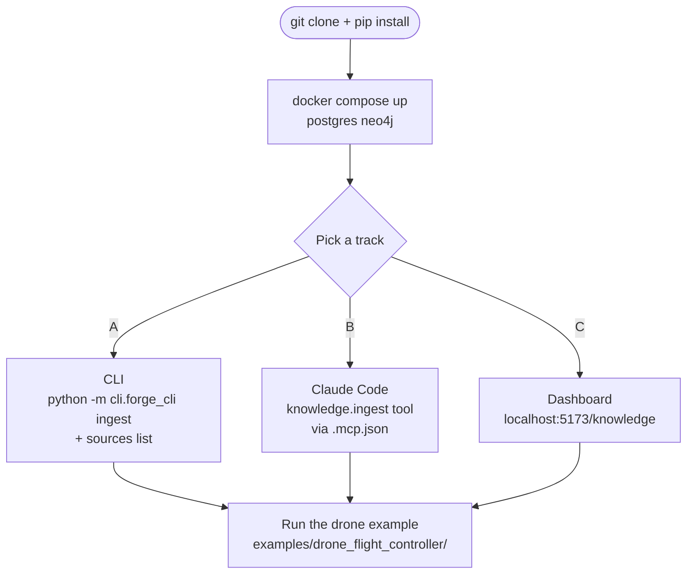

# Getting Started

> **Status:** Phase 1 (v0.1). Five-step quickstart from a fresh
> clone to "first useful result." Pick **one** of the three tracks
> in step 4 — they're parallel paths, not sequential. Last verified
> against `main` on 2026-05-10.

## 1. Prerequisites

- **Python 3.11+** on `PATH` as `python` (Claude Code spawns the
  MCP server with `command: "python"` — alias it if you only have
  `python3`).
- **Docker** + Docker Compose — optional but strongly recommended.
  Without it you lose pgvector-backed knowledge search and Neo4j
  graph queries (the in-memory fallback is best-effort).
- **Git**.

## 2. Install

```bash
git clone https://github.com/FidelOdok/MetaForge.git
cd MetaForge
python -m venv .venv && source .venv/bin/activate
pip install -e ".[dev,knowledge,cadquery]"
```

The extras are additive — pick the subset you need:

| Extra | Adds |
|---|---|
| `dev` | pytest, ruff, mypy, mkdocs-material |
| `knowledge` | LightRAG + asyncpg (pgvector) |
| `cadquery` | CadQuery CAD kernel |
| `freecad` | FreeCAD adapter (heavier; only if you need it) |
| `kicad` | KiCad adapter (read-only in Phase 1) |
| `neo4j` | Neo4j driver (real graph backend) |

A bare `pip install -e .` (no extras) still boots, but most adapters
will silently drop. See
[`troubleshooting.md`](troubleshooting.md#adapter-x-dropped-silently-at-startup)
if a tool you expect is missing from `tool/list`.

## 3. Boot the backends

Optional but recommended:

```bash
docker compose up -d postgres neo4j
docker compose ps                    # both should be "healthy"
```

Without these, knowledge search returns errors and Twin queries fall
back to in-memory mode (data evaporates on restart).

## 4. Pick a track

These are alternatives, not steps. Use whichever matches how you
like to work.



### Track A — CLI

The shortest path to "did anything just happen." Boot the gateway,
ingest a sample doc, then list it.

```bash
# Terminal 1 — gateway
python -m api_gateway.server          # or: docker compose up gateway

# Terminal 2 — CLI
python -m cli.forge_cli ingest tests/fixtures/knowledge/sample.md
python -m cli.forge_cli sources list
```

Expected output of `sources list`: a one-row table with the file
you just ingested.

Full command reference: [`cli-reference.md`](cli-reference.md).

### Track B — Claude Code (MCP)

Drive MetaForge from a Claude Code session. The repo's `.mcp.json`
already points at the standalone launcher, so cloning + opening the
repo in Claude Code is enough.

Full walkthrough: [`integrations/claude-code.md`](integrations/claude-code.md).

Quick smoke test once Claude Code is connected:

> **You:** "Use the metaforge MCP server to ingest
> `tests/fixtures/knowledge/sample.md` then search the KB for the
> word that appears at the top of the file."

Claude should call `knowledge.ingest` then `knowledge.search` and
return a hit. If it can't find the tools, see
[`integrations/mcp-config-examples.md`](integrations/mcp-config-examples.md).

### Track C — Dashboard

Boot the gateway + dashboard and explore the UI.

```bash
docker compose up gateway dashboard
```

Then open `http://localhost:5173/knowledge`. If you ingested
anything via Track A, it shows up in the sources table.

What each route does: [`dashboard-tour.md`](dashboard-tour.md).

## 5. Try a realistic example

The `examples/drone_flight_controller/` project is the canonical
end-to-end demo — a 4-layer PCB around the STM32F405RGT6, walked
through six engineering disciplines. It runs entirely off mock
adapters so it works on a fresh clone with no Docker:

```bash
cd examples/drone_flight_controller
python demo_validate_stress.py
```

Read [`examples/drone_flight_controller/README.md`](https://github.com/FidelOdok/MetaForge/tree/main/examples/drone_flight_controller#readme)
for the full walkthrough.

## Where to next

| If you want to … | Read |
|---|---|
| See every command | [`cli-reference.md`](cli-reference.md) |
| Tour the UI | [`dashboard-tour.md`](dashboard-tour.md) |
| Lay out your own project on disk | [`project-structure.md`](project-structure.md) |
| Know what's possible in Phase 1 | [`capability-matrix.md`](capability-matrix.md) |
| Drive from Claude Code / Codex | [`integrations/claude-code.md`](integrations/claude-code.md), [`integrations/codex.md`](integrations/codex.md) |
| See how the Knowledge UI is hosted | [`integrations/lightrag-ui.md`](integrations/lightrag-ui.md) |
| Hit a wall | [`troubleshooting.md`](troubleshooting.md) |
| Understand the long-term plan | [`roadmap.md`](roadmap.md) |

## Two minutes of context (optional)

MetaForge is a **local-first control plane** that turns engineer
intent into reviewable, manufacturable hardware deliverables. It
orchestrates specialist AI agents that run real tools (KiCad,
FreeCAD, CalculiX, SPICE) via the [Model Context Protocol](https://modelcontextprotocol.io).
The core rule:

> If it can't be versioned, reviewed, and built — MetaForge doesn't
> output it.

You stay in control: read-only by default, explicit approval
required for writes. See the architectural overview in
[`architecture.md`](architecture.md) once you've done a quickstart
and want the bigger picture.
