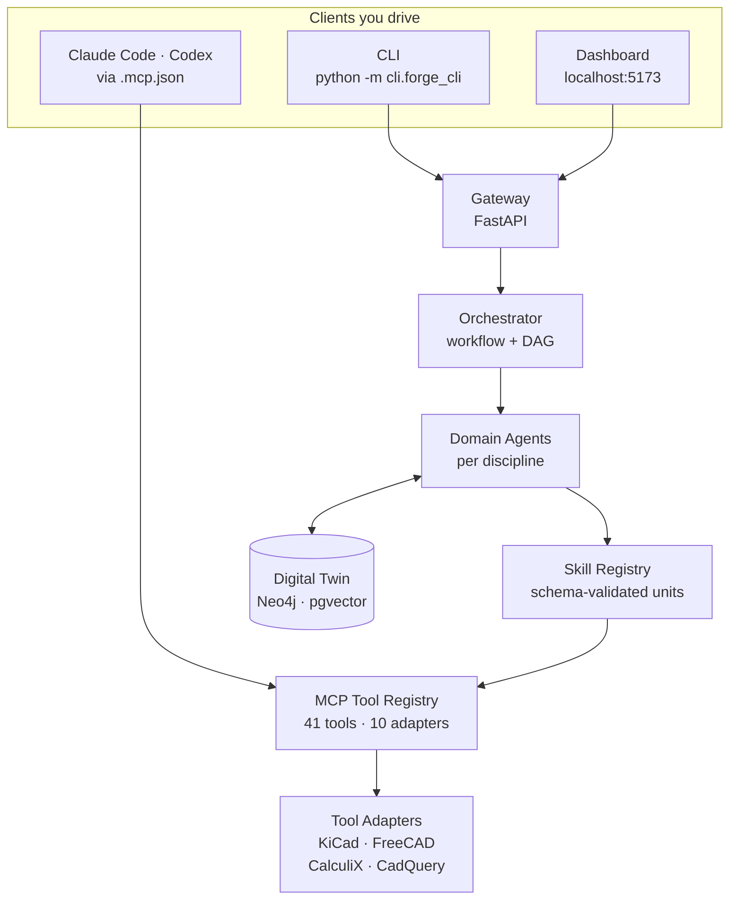

import Link from '@docusaurus/Link';

# Build with MetaForge

<p className="dx-lead">
  MetaForge brings projects, design artifacts, engineering agents and a digital twin into one
  workspace. The engine runs on your own machine; the dashboard, CLI and your coding agent are
  three windows onto the same gateway.
</p>

<div className="dx-start-links">
  <Link to="/getting-started/">
    <span className="dx-card-icon" aria-hidden="true">
      ❯
    </span>
    <span>
      <strong>Start building</strong>
      <small>Clone, start the backends, run your first ingest</small>
    </span>
  </Link>
  <Link to="/reference/gateway-api/">
    <span className="dx-card-icon" aria-hidden="true">
      {'{ }'}
    </span>
    <span>
      <strong>Explore the API</strong>
      <small>Connect your own tools to the gateway</small>
    </span>
  </Link>
</div>

## One workspace, one connected design

Every deliverable MetaForge produces is versioned, reviewable and buildable —
that is the whole constraint the system is designed around. Agents never touch
a tool directly; they go through the [Model Context
Protocol](https://modelcontextprotocol.io), and everything they produce lands
in the Digital Twin where it can be diffed and approved.



## Work through the engineering loop

A design is rarely finished in one pass. Define the intent, produce an
artifact, check it against analysis, and use what you learn to inform the next
revision.

<div className="dx-item-grid dx-loop">
  <div>
    <h3>01 / Define</h3>
    <p>Capture the objective, the constraints and the acceptance criteria.</p>
  </div>
  <div>
    <h3>02 / Design</h3>
    <p>Create or import the artifacts that describe the system.</p>
  </div>
  <div>
    <h3>03 / Validate</h3>
    <p>Check the assumptions against analysis, simulation or measurement.</p>
  </div>
  <div>
    <h3>04 / Review</h3>
    <p>Inspect the proposed change and approve the next iteration.</p>
  </div>
</div>

:::note[Keep the evidence next to the design]

A model is not proof of performance. Check the source, the assumptions and the
validation status of a result before an engineering decision rests on it — a
rendered 3D view and a moving simulation establish neither.

:::

## Make your first request

Start with the gateway health endpoint. It also tells you which authentication
mode the gateway is in, which is the one thing you cannot infer from the
outside.

```bash
export METAFORGE_GATEWAY="http://localhost:8000"

# Check that the gateway is available
curl "$METAFORGE_GATEWAY/health"

# Read the project library
curl "$METAFORGE_GATEWAY/v1/projects"
```

## Choose your starting point

<div className="dx-item-grid">
  <div>
    <h3>Drive it from the CLI</h3>
    <p>
      <Link to="/cli-reference/">Every subcommand</Link> with flags, examples and output shapes —
      including the interactive <code>forge chat</code> TUI.
    </p>
  </div>
  <div>
    <h3>Drive it from your agent</h3>
    <p>
      Set MetaForge up as an MCP server in <Link to="/integrations/claude-code/">Claude Code</Link> or{' '}
      <Link to="/integrations/codex/">Codex</Link> and let it call the tools directly.
    </p>
  </div>
  <div>
    <h3>Drive it from the dashboard</h3>
    <p>
      The <Link to="/dashboard-tour/">route-by-route tour</Link> of the workspace: projects, twin, runs,
      approvals and the bill of materials.
    </p>
  </div>
</div>

## What is actually built

Phase 1 (v0.1) covers 6–7 specialist agents across 6–7 disciplines, with KiCad
read-only. The [capability matrix](capability-matrix.md) is the honest list:
41 MCP tools, 11 dashboard routes, and the Phase-1 limits stated as limits.
[Troubleshooting](troubleshooting.md) covers what goes wrong first.

The [`examples/drone_flight_controller/`](https://github.com/FidelOdok/MetaForge/tree/main/examples/drone_flight_controller#readme)
reference project — a 4-layer PCB around the STM32F405RGT6 — runs end to end on
mock adapters with no Docker required.

## Architecture and contributors

Lower-level material for people **building** MetaForge rather than using it:
the [architecture overview](architecture.md), the [roadmap](roadmap.md), the
[skill](skill_spec.md), [MCP](mcp_spec.md) and [twin](twin_schema.md) specs,
the [testing strategy](testing-strategy.md) and the
[governance](governance.md) rules.

If you are contributing code, start with the repo-root
[`CLAUDE.md`](https://github.com/FidelOdok/MetaForge/blob/main/CLAUDE.md) — it
covers the development workflow, the observability requirements and the git
conventions. Operational runbooks and UAT artifacts stay in the repository
under [`docs/runbooks/`](https://github.com/FidelOdok/MetaForge/tree/main/docs/runbooks)
and [`docs/uat/`](https://github.com/FidelOdok/MetaForge/tree/main/docs/uat)
rather than on this site.
